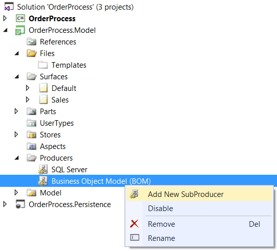
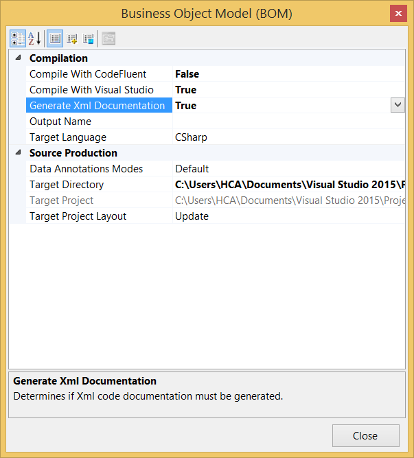

# Auto-Documentation

CodeFluent Entities provides a documentation sub-producer which allows you to:
* Decorate all members with XML comments (usable by Visual Studio IntelliSense and help tools),
* Generate XML, batch and configuration files to create a .CHM documentation using Sandcastle.

To benefit from it, you first need to add an instance of the sub-producer. To do so, select the Business Object Model Producer instance of your project, right-click on it and select “Add New SubProducer”:

Then in the “Add New SubProducer” dialog, select “Documentation” in the tree view and configure it:

*Note: the only required property is the “Sandcastle Target Directory“ which needs to be specified so the producer knows where to generate its output files.*

*If producing Sandcastle files, you need to have Sandcastle installed before generating and ensure the Sandcastle path is correct so you’ll be able to use the generated files right away.*

Since decorating all members of all your generated classes all the time can be quite an overkill during developments, **it is disabled by default** in the [Business Object Model Producer](../code-generators/c_business_object_model_generator.md), so you need to enable it as well. Double-click on your Business Object Model producer instance to open its configuration and set “Generate Xml Documentation” to “True”: