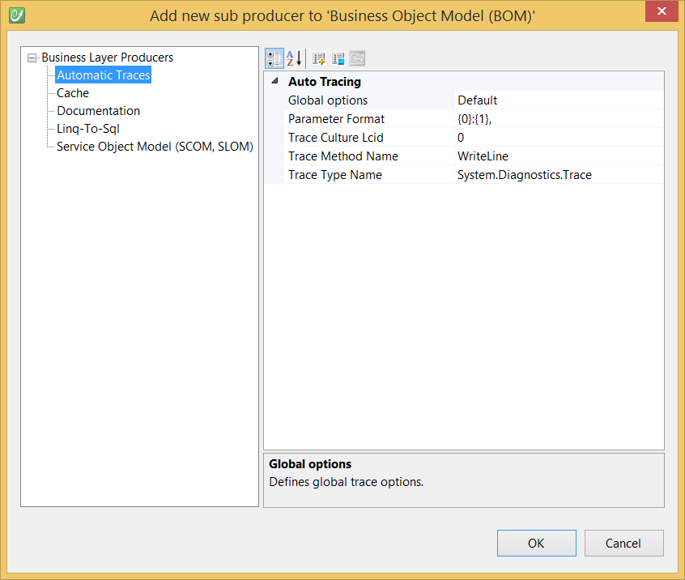

# Auto-Trace

The **Automatic Traces Producer** is a sub-producer of the [Business Object Model Producer](../code-generators/c_business_object_model_generator.md), which modifies its output by automatically adding traces to the generated code.

## Configuration

In the **Solution Explorer**, right-click on your **Business Object Model Producer** and select **Add New SubProducer**:


Select **Automatic Traces** amongst proposed producers and click OK:



Generating your model over again will automatically add traces to your code.

## Result

As a result, tracing messages are issued throughout your .NET Business Object Model. For instance, here's the code for an Email property of an entity without the Automatic Traces producer:

```csharp
public string Email
{
    get
    {
        return this._email;
    }
    set
    {
        this._email = value;
        this.EntityState = CodeFluent.Runtime.CodeFluentEntityState.Modified;
        this.OnPropertyChanged(new System.ComponentModel.PropertyChangedEventArgs("Email"));
    }
}
```

And here's the code with the Automatic Traces producer enabled:

```csharp
public string Email
{
    get
    {
        System.Diagnostics.Trace.WriteLine(string.Format("Customer:get_Email< traceRet0:\'{0}\'", this._email));
        return this._email;
    }
    set
    {
        System.Diagnostics.Trace.WriteLine(string.Format("Customer:set_Email> value:\'{0}\'", value));
        this._email = value;
        this.EntityState = CodeFluent.Runtime.CodeFluentEntityState.Modified;
        this.OnPropertyChanged(new System.ComponentModel.PropertyChangedEventArgs("Email"));
    }
}
```

## Producer Properties

| **Properties** | **Description** |
| -- | -- |
| Global Options | Indicates the subproducer when to trace (properties, constructors, methods, etc.). |
| Parameter Format | Defines how each method parameter will be traced. {0} represents the argument name. {1} represents the argument value. The last characters after the last } define the arguments separator. |
| Trace Culture LCID | Defines the culture used for method calls tracing. Set it to -1 to specify the runtime current UI culture. Set it to -2 to specify the runtime current culture. Set it to 0 (the default value) to omit the culture on method call. |
| Trace Method Name | Defines the trace method name (e.g. ```WriteLine```). |
| Trace Type Name | Defines the trace type CLR full type name (e.g. ```System.Diagnostics.Trace```). |
