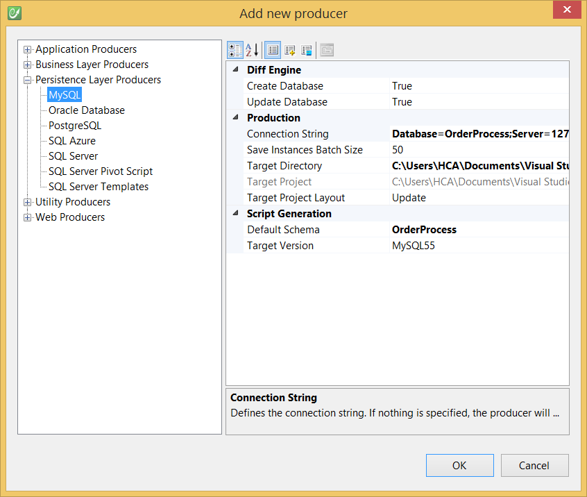

# MySQL

The **MySQL producer** is a persistence code generator: it translates a CodeFluent Entities model into a database running on **MySQL Server 5.1 and upper**. The database is created by generating SQL scripts which are then automatically ran on the configured server.

## Prerequisites

The MySQL Producer relies on the [MySQL Connector for .NET](http://www.mysql.com/downloads/connector/net/), version **6.5.4.0**. CodeFluent Entities requires the **MySql.Data** assembly.

## Generate the MySQL persistence layer

The MySQL Producer is implemented by the **CodeFluent.Producers.MySQLProduce**r class, contained in the **CodeFluent.Producers.MySQL** assembly.

The MySQL Producer is available in the **Persistence Layer Producers** section of the **Add New Producer** window.



* **Target Directory**: specifies where to generate the scripts,
connectionString: defines the connection string to use to connect to the database and run the scripts ("{0}" is an alias to the default namespace),
* **Produce Schemas**: indicates whether tables should be generated in schemas defined in the model using the "Schema Name" property, or ignoring them (all tables are generated in the default schema).
* **Target Version**: the version targeted by the producer. 

Which will generate scripts like this:

```sql

```

## Application configuration

You need to configure the generated classes to use MySQL as persistence layer (**persistenceTypeName**) and set a connection string indicating them where to connect to (**connectionString**). Here's a sample configuration for a sample **Northwind** application:

```xml
<configSections>
  <section name="Northwind" type="CodeFluent.Runtime.CodeFluentConfigurationSectionHandler, CodeFluent.Runtime" />
</configSections>
<Northwind persistenceTypeName="MySQL"
           connectionString="Server=localhost;Database=Northwind;User Id=root;Password=yourpassword;"
           mysql-useSchemas="true" /><configSections>
  <section name="Northwind" type="CodeFluent.Runtime.CodeFluentConfigurationSectionHandler, CodeFluent.Runtime" />
</configSections>
<Northwind persistenceTypeName="MySQL"
           connectionString="Server=localhost;Database=Northwind;User Id=root;Password=yourpassword;"
           mysql-useSchemas="true" />
```

*Note: **mysql-useSchemas** is optional and its default value is **true**. Its value at runtime must match the **Produce Schemas** property value which was used to generate the database.*