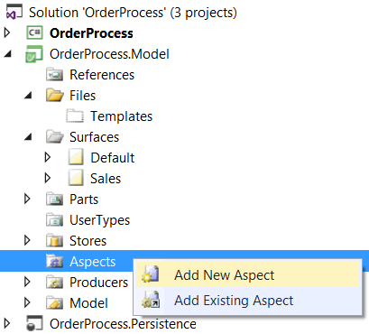
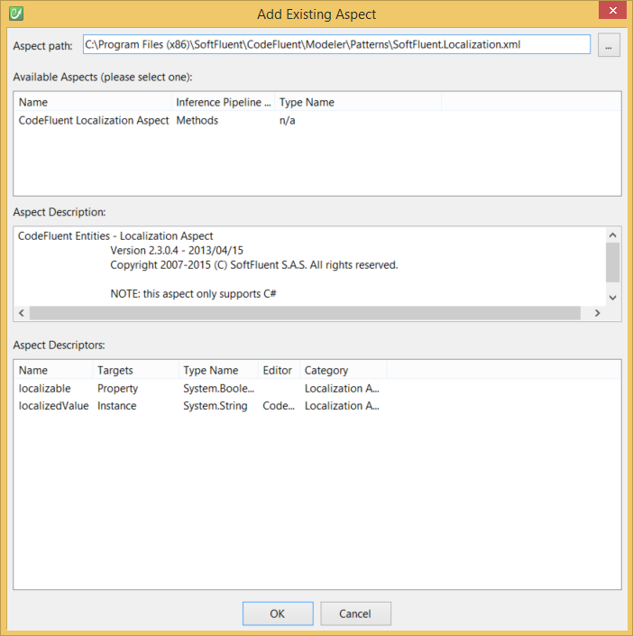
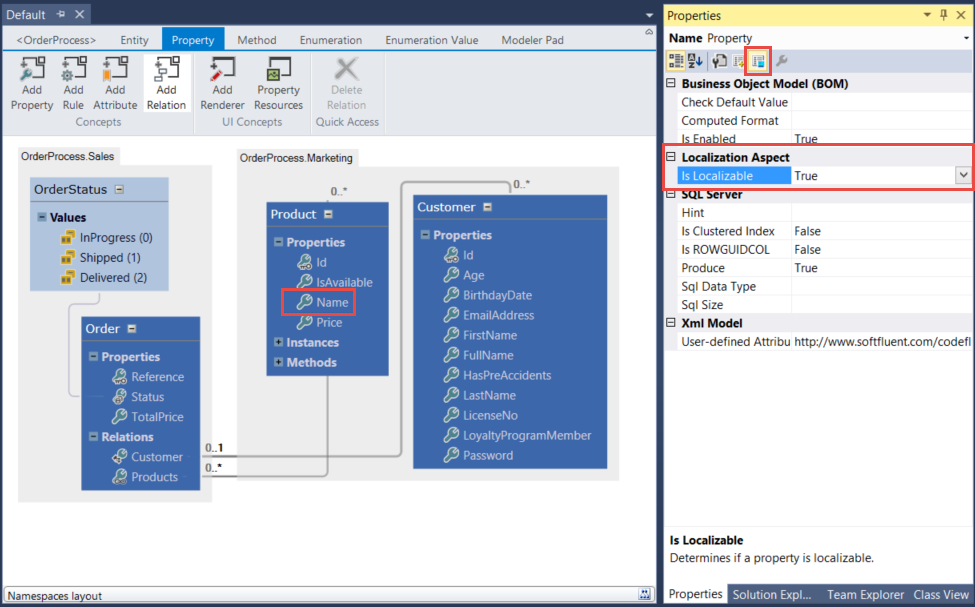
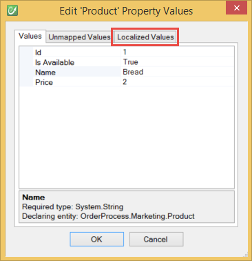
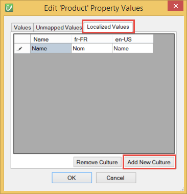
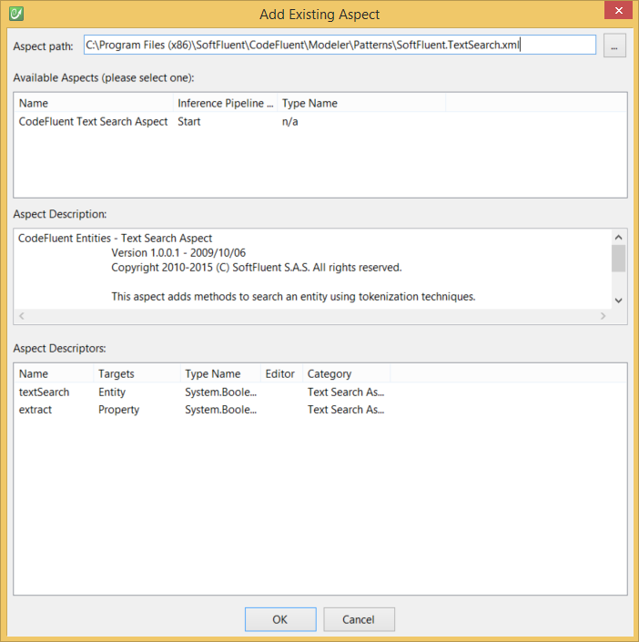

# Official Aspects

This section details and illustrates how to use CodeFluent Entities' shipped aspects.

## Overview

You can add a new Aspect to your CodeFluent Entities model from the **Aspects** node:

For more information, see the [Aspect oriented modeling overview]().

## Localization Aspect

The Localization Aspect enables data localization (a.k.a. dynamic localization) support.

*Note: This aspect only supports C# as the BOM layer. As the persistence layer, **Microsoft SQL Server** and **Oracle Database** are supported.*

Pick the **SoftFluent.Localization.xml** file into the CodeFluent Entities installation directory.

And specify some property as localizable:

Now you can edit your instances with a new tab called **Localized Values**:

And configure desired cultures:

See [this blog post](http://blog.codefluententities.com/2014/09/15/localize-dynamic-resources-using-aspect/) to see how to use the BOM to save localized data.

## TextSearch Aspect

The **Text Search Aspect** adds methods to search an entity using tokenization techniques (also known as Middle-Of-Word text search technique). The search is case insensitive and accent insensitive. Say you want to create a screen in you application where users can search their contacts: the Text Search Aspect provides a way to implement it.

*Note: For now, the aspect is only supported using Microsoft SQL Server databases.*

*Note: This aspect does not support entities with composite or object keys.*

Pick the **SoftFluent.TextSearch.xml** file into the CodeFluent Entities installation directory.

## HierarchyDeepLoad Aspect
## AssociationManage Aspect
## AutoFormattable Aspect