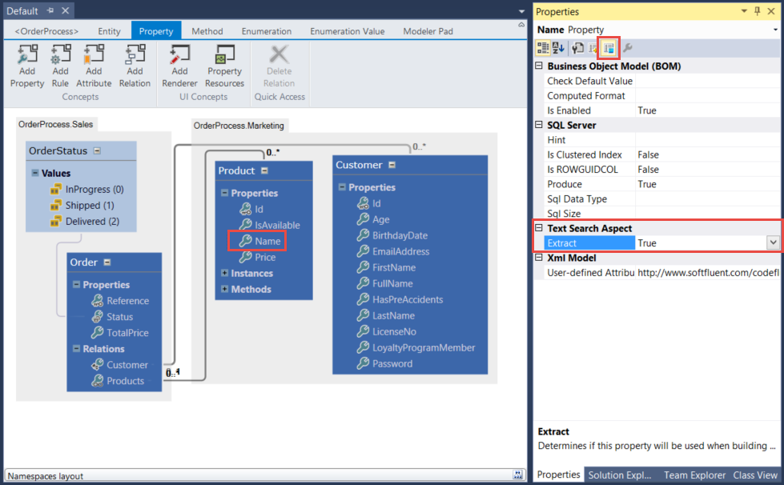
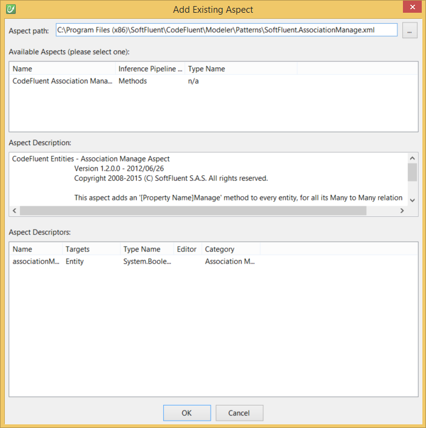

# Official Aspects

This section details and illustrates how to use CodeFluent Entities' shipped aspects.

## Overview

You can add a new Aspect to your CodeFluent Entities model from the **Aspects** node:


For more information, see the [Aspect oriented modeling overview]().

## Localization Aspect

The Localization Aspect enables data localization (a.k.a. dynamic localization) support.

*Note: This aspect only supports C# as the BOM layer. As the persistence layer, **Microsoft SQL Server** and **Oracle Database** are supported.*

Pick the **SoftFluent.Localization.xml** file into the CodeFluent Entities installation directory.


And specify some property as localizable:


Now you can edit your instances with a new tab called **Localized Values**:


And configure desired cultures:


See [this blog post](http://blog.codefluententities.com/2014/09/15/localize-dynamic-resources-using-aspect/) to see how to use the BOM to save localized data.

## TextSearch Aspect

The **Text Search Aspect** adds methods to search an entity using tokenization techniques (also known as Middle-Of-Word text search technique). The search is case insensitive and accent insensitive. Say you want to create a screen in you application where users can search their contacts: the Text Search Aspect provides a way to implement it.

*Note: For now, the aspect is only supported using Microsoft SQL Server databases.*

*Note: This aspect does not support entities with composite or object keys.*

Pick the **SoftFluent.TextSearch.xml** file into the CodeFluent Entities installation directory.


And specify some property to extract:



Generating your application you'll notice that in the persistence layer:

* a new table named **TextSearch[KeyType]** was created,
* a new stored procedure named **[EntityName]_TextSearchTokens** was created.

Likewise, in the Business Object Model (BOM) the following classes were created:

* **Utilities\TextSearchEntityType.cs**
* **Utilities\TextSearchUtilities.cs**
* **Utilities\TextSearch[KeyType].cs** (one per key type used),
* **Utilities\TextSearch[KeyType]Collection.cs** (one per key type used).

If the Service Object Model Producer is configured the following contracts and classes will be added:

* **Services\ITextSearch[KeyType]Service.cs**
* **Services\TextSearch[KeyType]Service.cs**

In our example, the **Contact** entity is text searchable, ergo its resulting **ContactCollection** class will have two new methods:

* **TextSearchTokens(bool oneOrMore, string[] tokens)**
* **PageTextSearchTokens(int pageIndex, int pageSize, CodeFluent.Runtime.PageOptions pageOptions, bool oneOrMore, string[] tokens)**

The first one allows you to retrieve all results of the search, when the second one is a paged and sortable version of the first method.

### Upgrading Non-Searchable Data

If you set-up the **Text Search Aspect** from the very beginning of your application's life, tokens will be created and deleted along their represented instance. However, if you add the **Text Search Aspect** on a database already containing data, you'll have to build all tokens for instances that where created prior to the addition of the aspect. In that matter, the **TextSearchUtilities** class provides a method named **UpdateAll**.

Create yourself a console application in which the **UpdateAll** method is called once per searchable class. For instance:

```csharp
class Program
{
        static void Main(string[] args)
        {
             TextSearchUtilities.UpdateAll(typeof(ContactCollection));
        }
}
```

The **UpdateAll** method will create tokens for all existing lines.

## AssociationManage Aspect

This aspect adds method(s) to all entities having at least one **many to many** relation.

Added methods enable association management without loading the corresponding collections. Such methods can be very useful when creating your user interface.

Using this aspect is very straightforward: import the part in your project, specify it's run step, and it'll automatically on **many to many** entities.



In the end, a method will be added to each entity holding a **many to many** relation to another entity. This method will be named **[RelationPropertyName]Manage**.

```csharp
public static bool ProductsManage(System.ComponentModel.CollectionChangeAction action, System.Guid orderReference, int productId)
{
    if ((action == default(System.ComponentModel.CollectionChangeAction)))
    {
        throw new System.ArgumentNullException("action");
    }
    if ((orderReference.Equals(CodeFluentPersistence.DefaultGuidValue) == true))
    {
        throw new System.ArgumentNullException("orderReference");
    }
    if ((productId == CodeFluentPersistence.DefaultInt32Value))
    {
        throw new System.ArgumentNullException("productId");
    }
    bool ret = CodeFluentPersistence.DefaultBooleanValue;
    CodeFluent.Runtime.CodeFluentPersistence persistence = CodeFluentContext.Get(OrderProcess.Constants.OrderProcessStoreName).Persistence;
    persistence.CreateStoredProcedureCommand(null, "Order", "ProductsManage");
    persistence.AddParameterEnumInt32("@action", action, new System.ComponentModel.CollectionChangeAction());
    persistence.AddParameter("@orderReference", orderReference);
    persistence.AddParameter("@productId", productId);
    System.Data.IDataReader reader = null;
    try
    {
        reader = persistence.ExecuteReader();
        if ((reader.Read() == true))
        {
            ret = ((bool)(ConvertUtilities.ChangeType(reader.GetValue(0), typeof(bool), null)));
        }
    }
    finally
    {
        if ((reader != null))
        {
            reader.Dispose();
        }
        persistence.CompleteCommand();
    }
    return ret;
}
```

*Known issue (Oracle only): This aspect adds a [EntityName]Manage stored procedure which calls two other delete and save stored procedure. Therefore, those stored procedures need to exist prior to the generation of the Manage procedure. As a consequence it is recommended to generate your model at least once before adding the aspect to avoid having an error such as:*

* *CodeFluent.Producers.Database.CodeFluentDatabaseProducerException: CF4703: Generated Oracle packages have errors: Error in 'Sample.CF_Order' line 125, position 26: 'PLS-00201: identifier 'CF_Product.SAVEORDERPRODUCTS' must be declared'.*
* *Error in 'Sample.CF_Order' line 125, position 26: 'PL/SQL: Statement ignored'.*
* *Error in 'Sample.CF_Order' line 126, position 26: 'PLS-00201: identifier 'CF_Product.DELETEORDERPRODUCTS' must be declared'.*
* *Error in 'Sample.CF_Order' line 126, position 26: 'PL/SQL: Statement ignored'.*

## AutoFormattable Aspect

The AutoFormattable aspect adds enhanced formatting capabilities to entities.

At production time, the AutoFormattable aspect iterates on entities with the autoFormattable attribute set to true, and adds an IFormattable implementation to the generated entity classes.

To apply the AutoFormattable pattern at entity level

## HierarchyDeepLoad Aspect
