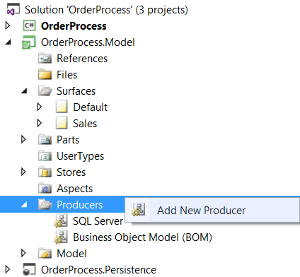
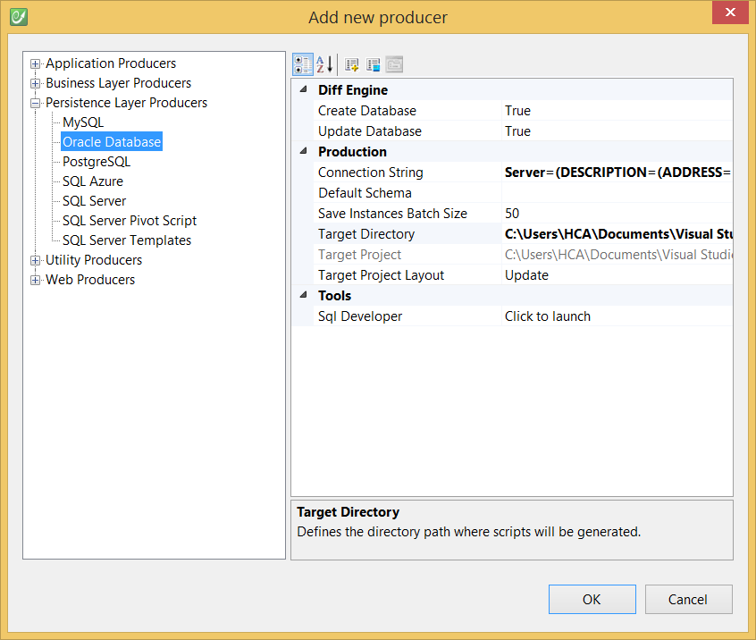
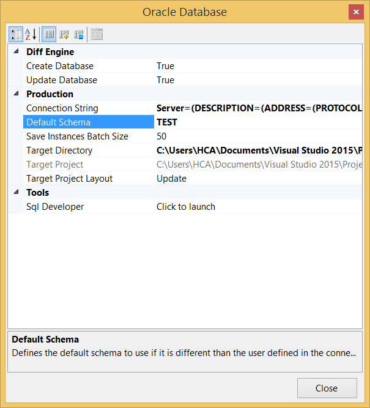

# Oracle Database

## Prerequisites

### System
### Oracle Server
### Oracle Client

**Oracle Instant Client (OCI)** must be installed on client machines.

At runtime, **Oracle's .NET provider (ODP.NET)** is required.

Moreover, **System.Data.OracleClient** is also supported by provided utilities (e.g. CodeFluent Meta Model Explorer, Database Explorer, Oracle Importer) or for generation purposes.

Note: To use ODP.NET at generation, CodeFluent Entities needs to be able to access the Oracle.DataAccess.dll assembly.

To do so, two ways are possible:

* either copy/paste the Oracle.DataAccess.dll in the same directory as CodeFluent Entities' assemblies,
* or add this assembly to the GAC.

Prefer using the first method as it's less restrictive and easily supports side-by-side scenarios where several applications can use different ODP.NET versions.

## Generate Oracle Database persistence layer

The Oracle Server Producer is implemented by the **CodeFluent.Producers.Database.Oracle.OracleProducer** class, contained in the **CodeFluent.Producers.Database** assembly which is shipped by default with CodeFluent.

Add the corresponding code generator:

 

 

Which will generate PL/SQL scripts like these:

```
CREATE OR REPLACE PACKAGE "SYS"."CF_Customer" AS
    PROCEDURE Load(CF_CURSOR OUT "SYS"."CF_#Runtime".CF_CURSOR_TYPE,
        "#Id" RAW);
    
    PROCEDURE LoadById(CF_CURSOR OUT "SYS"."CF_#Runtime".CF_CURSOR_TYPE,
        "#Id" RAW);
    
    PROCEDURE LoadAll(CF_CURSOR OUT "SYS"."CF_#Runtime".CF_CURSOR_TYPE,
        "#_orderBy0" NVARCHAR2 := NULL,
        "#_orderByDirection0" NUMBER := 0);
    
    PROCEDURE Save(CF_CURSOR OUT "SYS"."CF_#Runtime".CF_CURSOR_TYPE,
        "#Customer_Id" RAW,
        "#Customer_Age" NUMBER := NULL,
        "#Customer_BirthdayDate" DATE := NULL,
        "#Customer_EmailAddress" NVARCHAR2 := NULL,
        "#Customer_FirstName" NVARCHAR2 := NULL,
        "#Customer_FullName" NVARCHAR2 := NULL,
        "#Customer_HasPreAccidents" NUMBER := NULL,
        "#Customer_LastName" NVARCHAR2 := NULL,
        "#Customer_LicenseNo" NVARCHAR2 := NULL,
        "#Customer_LoyaltyProgramMember" NUMBER := NULL,
        "#Customer_Password" NVARCHAR2 := NULL,
        "#Customer_PaymentType" NUMBER := NULL,
        "#_trackLastWriteUser" NVARCHAR2,
        "#_rowVersion" RAW := NULL);
    
    PROCEDURE Delete(CF_CURSOR OUT "SYS"."CF_#Runtime".CF_CURSOR_TYPE,
        "#Customer_Id" RAW,
        "#_rowVersion" RAW);
    
END "CF_Customer";
/
CREATE OR REPLACE PACKAGE BODY "SYS"."CF_Customer" AS
    PROCEDURE Load(CF_CURSOR OUT "SYS"."CF_#Runtime".CF_CURSOR_TYPE,
        "#Id" RAW) AS
    V_CF_CURSOR "SYS"."CF_#Runtime".CF_CURSOR_TYPE;
    BEGIN
        OPEN V_CF_CURSOR FOR
        SELECT "Customer"."Customer_Id", "Customer"."Customer_Age", "Customer"."Customer_BirthdayDate", "Customer"."Customer_EmailAddress", "Customer"."Customer_FirstName", "Customer"."Customer_FullName", "Customer"."Customer_HasPreAccidents", "Customer"."Customer_LastName", "Customer"."Customer_LicenseNo", "Customer"."Customer_LoyaltyProgramMember", "Customer"."Customer_Password", "Customer"."Customer_PaymentType", "Customer"."_trackLastWriteTime", "Customer"."_trackCreationTime", "Customer"."_trackLastWriteUser", "Customer"."_trackCreationUser", "Customer"."_rowVersion" 
            FROM "SYS"."Customer"
            WHERE ("Customer"."Customer_Id" = "#Id");
    CF_CURSOR := V_CF_CURSOR;
    END;
    
    PROCEDURE LoadById(CF_CURSOR OUT "SYS"."CF_#Runtime".CF_CURSOR_TYPE,
        "#Id" RAW) AS
    V_CF_CURSOR "SYS"."CF_#Runtime".CF_CURSOR_TYPE;
    BEGIN
        OPEN V_CF_CURSOR FOR
        SELECT "Customer"."Customer_Id", "Customer"."Customer_Age", "Customer"."Customer_BirthdayDate", "Customer"."Customer_EmailAddress", "Customer"."Customer_FirstName", "Customer"."Customer_FullName", "Customer"."Customer_HasPreAccidents", "Customer"."Customer_LastName", "Customer"."Customer_LicenseNo", "Customer"."Customer_LoyaltyProgramMember", "Customer"."Customer_Password", "Customer"."Customer_PaymentType", "Customer"."_trackLastWriteTime", "Customer"."_trackCreationTime", "Customer"."_trackLastWriteUser", "Customer"."_trackCreationUser", "Customer"."_rowVersion" 
            FROM "SYS"."Customer"
            WHERE ("Customer"."Customer_Id" = "#Id");
    CF_CURSOR := V_CF_CURSOR;
    END;
    
    PROCEDURE LoadAll(CF_CURSOR OUT "SYS"."CF_#Runtime".CF_CURSOR_TYPE,
        "#_orderBy0" NVARCHAR2 := NULL,
        "#_orderByDirection0" NUMBER := 0) AS
    V_CF_CURSOR "SYS"."CF_#Runtime".CF_CURSOR_TYPE;
    BEGIN
        OPEN V_CF_CURSOR FOR
        SELECT "Customer"."Customer_Id", "Customer"."Customer_Age", "Customer"."Customer_BirthdayDate", "Customer"."Customer_EmailAddress", "Customer"."Customer_FirstName", "Customer"."Customer_FullName", "Customer"."Customer_HasPreAccidents", "Customer"."Customer_LastName", "Customer"."Customer_LicenseNo", "Customer"."Customer_LoyaltyProgramMember", "Customer"."Customer_Password", "Customer"."Customer_PaymentType", "Customer"."_trackLastWriteTime", "Customer"."_trackCreationTime", "Customer"."_trackLastWriteUser", "Customer"."_trackCreationUser", "Customer"."_rowVersion" 
            FROM "SYS"."Customer";
    CF_CURSOR := V_CF_CURSOR;
    END;
    
    PROCEDURE Save(CF_CURSOR OUT "SYS"."CF_#Runtime".CF_CURSOR_TYPE,
        "#Customer_Id" RAW,
        "#Customer_Age" NUMBER := NULL,
        "#Customer_BirthdayDate" DATE := NULL,
        "#Customer_EmailAddress" NVARCHAR2 := NULL,
        "#Customer_FirstName" NVARCHAR2 := NULL,
        "#Customer_FullName" NVARCHAR2 := NULL,
        "#Customer_HasPreAccidents" NUMBER := NULL,
        "#Customer_LastName" NVARCHAR2 := NULL,
        "#Customer_LicenseNo" NVARCHAR2 := NULL,
        "#Customer_LoyaltyProgramMember" NUMBER := NULL,
        "#Customer_Password" NVARCHAR2 := NULL,
        "#Customer_PaymentType" NUMBER := NULL,
        "#_trackLastWriteUser" NVARCHAR2,
        "#_rowVersion" RAW := NULL) AS
    V_CF_CURSOR "SYS"."CF_#Runtime".CF_CURSOR_TYPE;
    "CF__trackLastWriteUser" NVARCHAR2(64) := "#_trackLastWriteUser";
    BEGIN
        IF("CF__trackLastWriteUser" IS NULL) THEN
            SELECT USER INTO "CF__trackLastWriteUser" FROM DUAL;
        END IF;
        IF("#_rowVersion" IS NOT NULL) THEN
            UPDATE "SYS"."Customer" SET
                "Customer"."Customer_Age" = "#Customer_Age",
                "Customer"."Customer_BirthdayDate" = "#Customer_BirthdayDate",
                "Customer"."Customer_EmailAddress" = "#Customer_EmailAddress",
                "Customer"."Customer_FirstName" = "#Customer_FirstName",
                "Customer"."Customer_FullName" = "#Customer_FullName",
                "Customer"."Customer_HasPreAccidents" = "#Customer_HasPreAccidents",
                "Customer"."Customer_LastName" = "#Customer_LastName",
                "Customer"."Customer_LicenseNo" = "#Customer_LicenseNo",
                "Customer"."Customer_LoyaltyProgramMember" = "#Customer_LoyaltyProgramMember",
                "Customer"."Customer_Password" = "#Customer_Password",
                "Customer"."Customer_PaymentType" = "#Customer_PaymentType",
                "Customer"."_trackLastWriteUser" = "CF__trackLastWriteUser",
                "Customer"."_trackLastWriteTime" = SYSDATE,
                "Customer"."_rowVersion" = SYS_GUID()
                WHERE (("Customer"."Customer_Id" = "#Customer_Id") AND ("Customer"."_rowVersion" = "#_rowVersion"));
            IF(SQL%ROWCOUNT = 0) THEN
                ROLLBACK;
                RAISE_APPLICATION_ERROR (-20001, 'Concurrency error in procedure Customer_Save');
            END IF;
            OPEN V_CF_CURSOR FOR
            SELECT "Customer"."_rowVersion" 
                FROM "SYS"."Customer"
                WHERE ("Customer"."Customer_Id" = "#Customer_Id");
        ELSE
            INSERT INTO "SYS"."Customer" (
                "Customer"."Customer_Id",
                "Customer"."Customer_Age",
                "Customer"."Customer_BirthdayDate",
                "Customer"."Customer_EmailAddress",
                "Customer"."Customer_FirstName",
                "Customer"."Customer_FullName",
                "Customer"."Customer_HasPreAccidents",
                "Customer"."Customer_LastName",
                "Customer"."Customer_LicenseNo",
                "Customer"."Customer_LoyaltyProgramMember",
                "Customer"."Customer_Password",
                "Customer"."Customer_PaymentType",
                "Customer"."_trackCreationUser",
                "Customer"."_trackLastWriteUser",
                "Customer"."_rowVersion")
            VALUES (
                "#Customer_Id",
                "#Customer_Age",
                "#Customer_BirthdayDate",
                "#Customer_EmailAddress",
                "#Customer_FirstName",
                "#Customer_FullName",
                "#Customer_HasPreAccidents",
                "#Customer_LastName",
                "#Customer_LicenseNo",
                "#Customer_LoyaltyProgramMember",
                "#Customer_Password",
                "#Customer_PaymentType",
                "CF__trackLastWriteUser",
                "CF__trackLastWriteUser",
                SYS_GUID());
            OPEN V_CF_CURSOR FOR
            SELECT "Customer"."_rowVersion" 
                FROM "SYS"."Customer"
                WHERE ("Customer"."Customer_Id" = "#Customer_Id");
        END IF;
        COMMIT;
    CF_CURSOR := V_CF_CURSOR;
    END;
    
    PROCEDURE Delete(CF_CURSOR OUT "SYS"."CF_#Runtime".CF_CURSOR_TYPE,
        "#Customer_Id" RAW,
        "#_rowVersion" RAW) AS
    V_CF_CURSOR "SYS"."CF_#Runtime".CF_CURSOR_TYPE;
    BEGIN
        DELETE FROM "SYS"."Customer" WHERE ("Customer"."Customer_Id") IN (SELECT "Customer"."Customer_Id" FROM "SYS"."Customer" 
            WHERE (("Customer"."Customer_Id" = "#Customer_Id") AND ("Customer"."_rowVersion" = "#_rowVersion")));
        IF(SQL%ROWCOUNT = 0) THEN
            ROLLBACK;
            RAISE_APPLICATION_ERROR (-20001, 'Concurrency error in procedure Customer_Delete');
        END IF;
        COMMIT;
    CF_CURSOR := V_CF_CURSOR;
    END;
    
END "CF_Customer";
```

### Default Schema

By default, the value of the **defautSchema** attribute is the user name that is specified in the connection string (**Test** in the sample above). Hence, to successfully generate here-above's Oracle database, the **Test** user must have sufficient rights to create tables, views, stored procedures, packages, etc.

However, if you'd like to use a privileged user account to connect to the database, but generate using a specific schema, you can do this by specifying the **defaultSchema** attribute. This can be done as so:

 

*Note: If ever you errors regarding distributed/automated transactions, OraMTS, or the "CF1082: Automatic transaction enlistment has failed" error; set Enlist=false in the connection string to disable transaction enlistment.*

## BOM configuration

## Supported Features

The following features are supported:

* Generating tables, and constraints (primary keys and foreign keys),
* Generating schemas/users,
* Generating sequences for auto-incremented columns,
* Generating views,
* Generating stored procedures (organized in specific packages),
* Generating instances,
* Saving instances,
* Saving Binary Large Objects (BLOB) instances.

*Note: Some of these features require **DBA** privileges.*