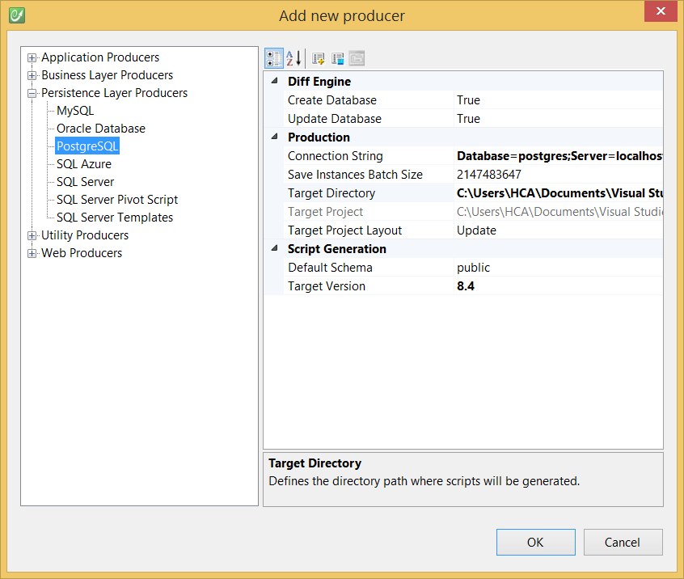

# PostgreSQL

The **PostgreSQL Producer** is a persistence code generator: it translates a CodeFluent Entities model into a database running on **PostgreSQL Server 8.4 and upper**. The database is created by generating SQL scripts which are then automatically ran on the configured server.

## Prerequisites

### .NET

The PostgreSQL Producer relies on the [Npgsql2](http://npgsql.projects.postgresql.org/) library, version **2.0.11**. CodeFluent Entities requires the Npgsql assembly.

### OSSP

The producer also requires the [libossp-uuid](http://www.ossp.org/pkg/lib/uuid/) package to be installed on the server.

### Windows

Please note that libossp-uuid is shipped with the Windows PostgreSQL 8.4+ standard installation package.

### Linux

You need to install the postgresql-contrib package.

## Generate PostgreSQL persistence layer

The PostgreSQL Producer is implemented by the **CodeFluent.Producers.PostgreSQLProducer** class, contained in the **CodeFluent.Producers.PostgreSQL** assembly.


The PostgreSQL Producer is available in the **Persistence Layer Producers** section of the **Add New Producer** window.



Which will generate scripts like this:

```
CREATE OR REPLACE FUNCTION "public"."Customer_Delete"
(
    "#Customer_Id" uuid,
    "#_rowVersion" bytea
)
RETURNS void
VOLATILE
CALLED ON NULL INPUT
AS $$
DECLARE
    "cf_refcursor" refcursor;
    
BEGIN
    DELETE FROM "public"."Customer"
        WHERE (("Customer"."Customer_Id" = "#Customer_Id") AND ("Customer"."_rowVersion" = "#_rowVersion"));
    IF NOT FOUND THEN
        RAISE EXCEPTION 'CodeFluent Runtime: Concurrency error';
    END IF;

END;
$$ LANGUAGE plpgsql;
//
//
```

## Application configuration

You need to configure the generated classes to use PostgreSQL as persistence layer (**persistenceTypeName**) and set a connection string indicating them where to connect to (**connectionString**). Here's a sample configuration for a sample application named **Northwind**:

```xml
<configSections>
  <section name="Northwind" type="CodeFluent.Runtime.CodeFluentConfigurationSectionHandler, CodeFluent.Runtime" />
</configSections>
<Northwind persistenceTypeName="PostgreSQL"
           connectionString="Server=localhost;Database=PostgreSQL_Test;User Id=postgres;Password=yourpassword;"
           postgresql-defaultSchema="public"
           postgresql-useParameterCache="true" />
```

*Notes: **postrgresql-defaultSchema** and **postgresql-useParameterCache** are optional and their respective default values are "public" and "true".*

The **default schema** defines the schema to be used when an entity doesn't have a schema. By default, the "public" schema is used.

The **postgresql-useParameterCache** attribute allows you to disable the use of the parameter cache system which stores lists of parameters for each stored procedure that is used.

## Supported features

The following features are supported:

* Generating schemas and cross-schemas relations
* Generating tables
* Generating constraints (primary keys and foreign keys)
* Generating sequences for auto-incremented columns
* Generating views
* Generating stored procedures (using SQL or PL/pgSQL)
* Generating instances
* Saving instances
* Saving Binary Large Objects (BLOB) instances in bytea columns

## Unsupported features

CFQL [Search](../development-guide/search_methods.md) methods


## Special cases

### Binary Large Objects (BLOB) management

Any binary large object defined in the model is stored in PostgreSQL in fields of type [bytea](http://www.postgresql.org/docs/8.4/static/datatype-binary.html), which implies **a max size of 1GB** per object.

### Creating raw methods

You can only write your raw methods in PL/pgSQL. Other languages are not supported.

### PL/pgSQL Functions

By default, if your method is returning something, the generated stored procedure skeleton will return a ```refcursor```. The return type can be changed through the **customReturnType** attribute on the method. By default a ```refcursor``` named ```cf_refcursor``` is declared before opening the ```BEGIN...END;``` block of the procedure, and returned before the end of this block. It is up to you to return another ```refcursor``` in your raw code.

If you need to declare more variables in the ```DECLARE...BEGIN``` block, you can do it through the **customVariables** attribute.

### Example of a load() raw function

This method loads all the instances of the Employee entity. It has no other interest than to demonstrate how to create a simple raw function:

```sql
load() raw
```

```
OPEN cf_refcursor FOR SELECT * FROM "public"."Employee";
```