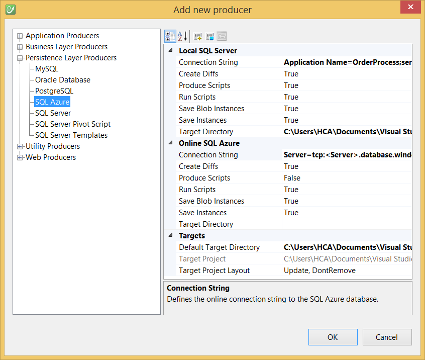

# SQL Azure

The SQL Azure producer translates your model into SQL Azure compliant T-SQL scripts to generate the equivalent SQL Azure database. Moreover the generated scripts can be run automatically on the SQL Azure database.

*Note: Unlike the SQL Server Producer, this producer doesn't create the SQL Azure database. On SQL Azure, billing is based, in part, on your database edition and size. Therefore, we're letting developers create their database as desired, and the tool focuses on generating the database schema (schemas, tables, views, stored procedures, constraints, data, etc.).*

Another key feature of the SQL Azure producer, is that you can work locally, by generating on a local SQL Server database. In this scenario, the SQL Azure producer will generate 100% compliant code on both platforms. Furthermore, when generating on a SQL Server instance, the producer detects it and will use a **diff engine** which will update the database through generations rather than dropping and creating it over.

This diff engine is in fact a key feature since it allows developers to generate continuously, without ever losing data. Once the application is ready to go live, the developer can configure the producer to run the scripts on the online SQL Azure database.

*Using CodeFluent Entities versions **prior to** 60809.671, the Diff Engine uses SQL Distributed Management Objects (SQL-DMO), therefore, if using SQL Server 2008 or SQL Server 2008 R2 as your local server, you'll need to install this component on your server to benefit from this feature.*

*You can download them here (only the “Microsoft SQL Server 2005 Backward Compatibility Components” is needed): http://www.microsoft.com/downloads/en/details.aspx?FamilyId=C6C3E9EF-BA29-4A43-8D69-A2BED18FE73C&displaylang=en.*

## Using the producer

As you can see the producer configuration is composed of two sections:

* local settings,
* online settings

The **Produce Scripts** property of the two sections (true for **local** and false for **online** by default) control which of the settings are used.

If **Produce Scripts** is true for the **local** section, the producer generates the scripts in the directory pointed by the **Target Directory** path of the **local** section, and runs them on the database pointed by the **Connection String** of the **local** section, if the **Run Scripts** (true by default) is set to true in the **local** section.

By clicking on the Advanced button (the one with the yellow 'plus' sign at the top of the property grid), you'll access extra options, common to both settings (online and local) allowing you to control the script generation. Among available options are wether to produce views, schemas, the file encoding, etc.

SQL Azure being a cloud version of SQL Server, you'll find that except this dual setting to support local and online scenarios, features (namespace, entities, relations, views, methods, etc.), most options (Produce Views, Produce Schemas, etc.) and behaviors (script generation and execution), are the same between both producers.