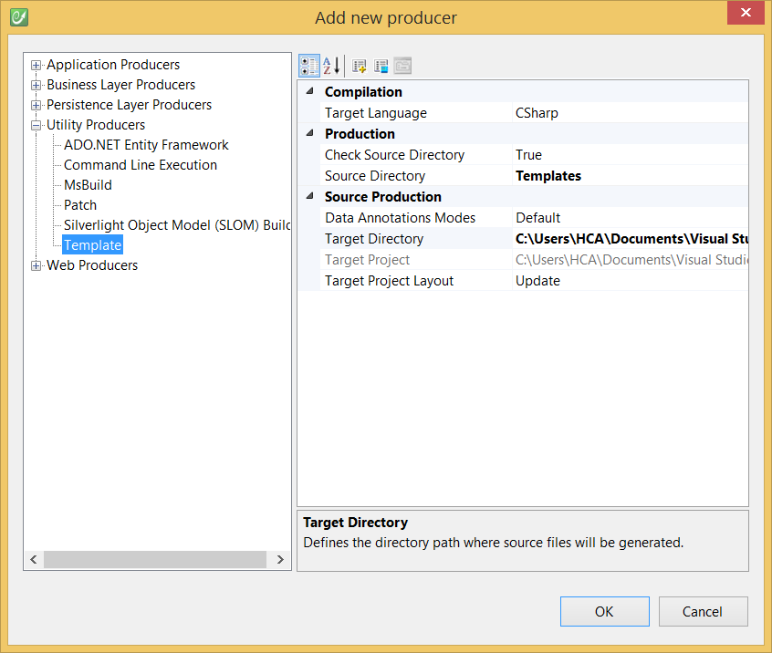

# Template

The template producer is based on CodeFluent Entities' template engine to allow developers to generate text files at production time.

*Note: All text files are supported. Moreover, the template producer also fully supports specific file formats such as RTF and HTML files.*

Since it uses the template engine, the following basic rules are observed:
* Template file names must be decorated by the **[Template]** prefix,
* Files or folders decorated by the **[Skip]** prefix will be skipped,
* All files contained in a template directory are copied in the output directory unless they're explicitly marked to be skipped.

This topic describes how to configure this producer to generate custom text files based on the design model and on template files. 

The Template producer is one of the template producers shipped out-of-the-box with CodeFluent Entities, you can configure this producer to generate any text base files such as:
* custom documentation files
* custom configuration files. 

See [this blog post](http://blog.codefluententities.com/2013/03/20/generate-asp-net-web-api-controllers-using-template/) for a concrete example.