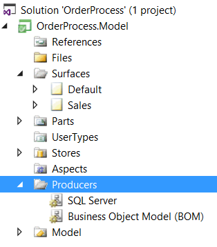

# Overview

## Producer

CodeFluent Entities is a model driven software factory which based on a producer logic, will generate (or 'produce') platform optimized code. The **Producers** are code generators.

Starting from a platform independent model which defines the business logic of your application, CodeFluent Entities will build a meta-model which will be translated into platform dependent code by producers. For instance, the Microsoft SQL Server Producer will produce from the meta-model all corresponding database objects: namespaces will become schemas, entities translated into tables, views into views, methods into stored procedures and so on.

Nonetheless, we don't intend to replace developers, and we don't think a full enterprise-class application can be entirely generated: there will always be some very specific screen or logic that will require hand-made code. Therefore, the code focuses on recurrent, low value, but necessary needs, freeing developers so they can focus on the real part.

Finally, all generated code is fully extensible and customizable by developers.

