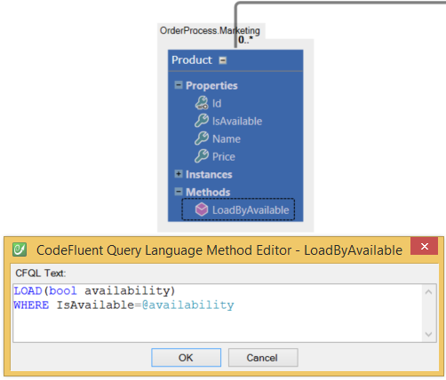
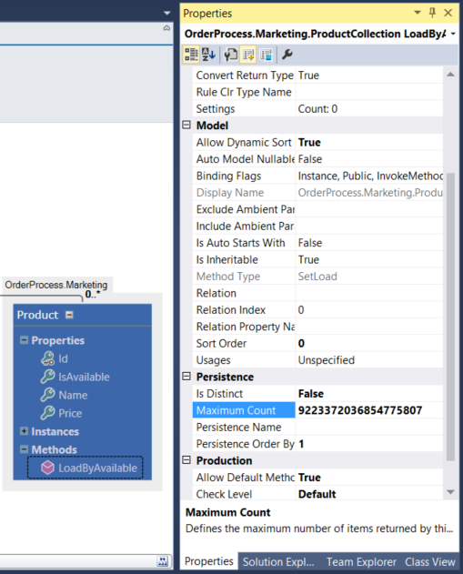

# CFQL

CFQL ("CodeFluent Query Language") supports operators such as:

* unary operators: not, exists
* binary operators: and, or, equals, contains, freetext, like, =, <>, >=, <=, >, <
* set operator: in (expression1, expression2, ... , expressionM)



## Unary Operator

Those operators are useful if you want to load all line where a column is null or non null. For instance, this example loads all menus having a parent menu, ```LoadLeafMenu``` :
```sql
LOAD
WHERE Parent EXISTS
```

The ```NOT``` operator can be used to reverse the following predicate, ```LoadRootMenu```:

```sql
LOAD
WHERE NOT (Parent exists)
```

*Note: Parenthesis are optional and where specified for readability.*

## Binary Operators

The most common ones are ```AND``` and ```OR```, which are very straight forward.

```LoadByTitleAndPosition``` :

```sql
LOAD(Title, Position)
WHERE Title = @Title AND Position = @Position
```

```LoadByTitleOrPosition``` :

```sql
LOAD(Title, Position)
WHERE Title = @Title OR Position = @Position
```

*Note: As you can see in the example above, **types of arguments passed to the method don't have to be specified since they correspond to properties declared on the current entity**. Writing CFQL methods this way allows to have a very flexible model since arguments types will automatically be updated if its related property type was changed.*

## Equality and Inequality Operators

Equality and inequality operators (```=```, ```<>```, ```>=```, ```<=```, ```>```, ```<```) allow you to compare values between one another.

Here's a set of examples:

```LoadFirsts``` :
```sql
LOAD
WHERE Position = 0
```

```LoadNonFirsts``` :
```sql
LOAD
WHERE Position <> 0
```

```LoadCurrentAndPrevious``` :
```sql
LOAD(Position)
WHERE Position <= @Position
```

```LoadPrevious``` :
```sql
LOAD(Position)
WHERE Position < @Position
```

```LoadCurrentAndNext``` :
```sql
LOAD(Position)
WHERE Position >= @Position
```

```LoadNext``` :
```sql
LOAD(Position)
WHERE Position > @Position
```

## String Operators

Available operators are: ```EQUALS``` (```=``` is also supported), ```CONTAINS```, ```FREETEXT``` and ```LIKE``` (```IS LIKE```, ```STARTS WITH```, ```STARTSWITH``` and ```#``` are also supported).

```LoadByTitle``` :
```sql
LOAD(Title)
WHERE Title = @Title
```

```LoadByTitleStartingWith``` :
```sql
LOAD(Title)
WHERE Title LIKE @Title
```

```LoadByDescriptionContaining``` :
```sql
LOAD(string token)
WHERE Description CONTAINS @token
```

```LoadByDescriptionFeetexting``` :
```sql
LOAD(string token)
WHERE Description FREETEXT @token
```

*Note: Desired column must be have a **Full-Text index** defined to be used with the ```FREETEXT``` and ```CONTAINS``` operators.*

## Set Operator

Using the ```IN``` operator you can exclude values that aren't included in a list. For instance, ```LoadRootAndTechnical```:
```sql
LOAD
WHERE Title IN ('Root', 'Technical')
```

The ```IN``` operator can also be used with dynamic parameters, ```LoadRootAndTechnical```:
```sql
LOAD(string value1, string value2)
WHERE Title IN (@value1, @value2)
```

Furthermore, if sending a string array as a parameter, the in parameter can be used to filter values by the passed array, ```LoadRootAndTechnical```:
```sql
LOAD(string[] values)
WHERE Title IN (@values)
```

*Note: the previous method uses an out-of-the-box feature of the **SQL Server Producer**. Therefore, as of today, it's not supported by other persistence producers.*

## Top

There isn't a ```TOP``` operator in CFQL, however top is supported on the **Method** property grid through the **Maximum Count** property.

