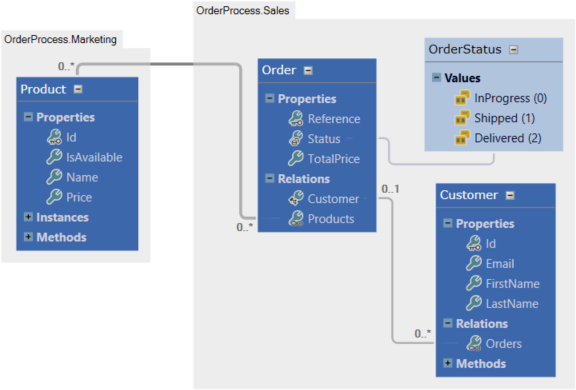

# CRUD operations

At design time, you modeled your business application using business entities, each and every one of them having properties, and relations to one another. Once the business model is ready, you can generate your **Business Object Model** (BOM).

By default, two classes are generated per entity: the first class corresponds to the entity class, and the other one to a collection of those entities. For instance a **Customer** entity will generate a **Customer** class and a **CustomerCollection** class which can manipulate several Customer instances. Apart from that notion, the BOM will be organized exactly as designed in the model.


## Basic CRUD

For instance, given the following model:



The **Customer** class will contain four properties: 
* **Id** of type **guid**
* **Email** of type **string**
* **FirstName** of type **string**
* **LastName** of type **string**
* **Orders** of type **OrderCollection**

Without any custom code, you then can:


### Load a customer

```csharp
// Loads the customer with the id 42
Customer customer = Customer.Load(42);
 
// Loads all customers from database
CustomerCollection customers = Customer.LoadAll();
```

