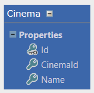
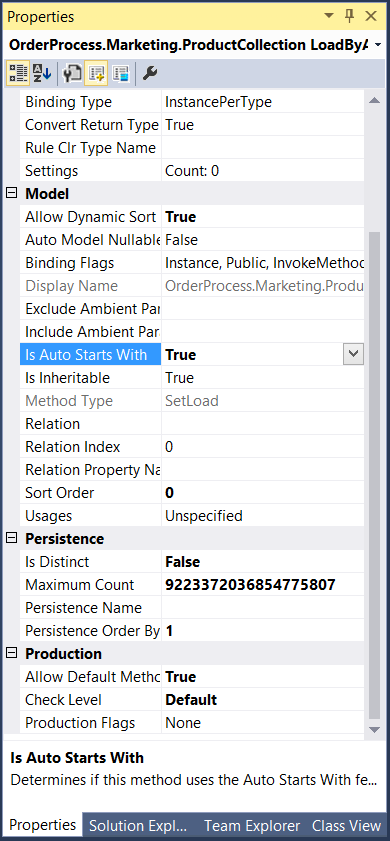

# Search methods

Search methods are CodeFluent Query Language (**CFQL**) methods which allow you to define platform independent queries to implement searching capabilities in your application. Persistence producers will then translate those platform independent queries into actual SQL queries.

## Search



For instance, searching for cinemas by name and a cinema identifier.

```SimpleSearch``` :

```sql
SEARCH(Name, CinemaId)
```

The Microsoft SQL Server code generator will produce the following stored procedure:

```sql
CREATE PROCEDURE [dbo].[Cinema_SimpleSearch]
(
@Name [nvarchar] (256) = NULL,
@CinemaId [nvarchar] (256) = NULL,
@_orderBy0 [nvarchar] (64) = NULL,
@_orderByDirection0 [bit] = 0
)
AS
SET NOCOUNT ON
DECLARE @sql nvarchar(max), @paramlist nvarchar(max)
SELECT @sql=
'SELECT DISTINCT [Cinema].[Cinema_Id], [Cinema].[Cinema_Name], [Cinema].[Cinema_CinemaId]
    FROM [Cinema]
    WHERE (1 = 1)'
SELECT @paramlist = '@Name nvarchar (256),
    @CinemaId nvarchar (256),
    @_orderBy0 nvarchar (64),
    @_orderByDirection0 bit'
IF @Name IS NOT NULL
    SELECT @sql = @sql + ' AND ([Cinema].[Cinema_Name] = @Name)'
IF @CinemaId IS NOT NULL
    SELECT @sql = @sql + ' AND ([Cinema].[Cinema_CinemaId] = @CinemaId)'
EXEC sp_executesql @sql, @paramlist,
    @Name,
    @CinemaId,
    @_orderBy0,
    @_orderByDirection0
RETURN
GO
```

*Note: The ```(1 = 1)``` statement is for development conveniences: it avoids us to create a special case for the first ```AND``` condition. Instead for each condition we add a ```WHERE (1 = 1)```, so we are sure the generated ```WHERE``` clause is present. Moreover, the SQL Server's query optimizer will remove such statements when compiling stored procedures. In the end, those ```(1 = 1)``` have no consequences.*

## Wildcards

### The Star (*)

The ```*``` wildcard is available in search methods. It indicates the method to search by all persistent properties of the entity.

```Search``` :
```sql
SEARCH(*)
```

### The Double Star (**)

The ```**``` wildcard is useful when working on entities deriving from a root entity. Say you have a BaseProduct, which has several derived entity such as Product, OnlineProduct, etc. The '**' wilcard allows you to search on the base entity properties as well as all derived entity properties as well.

```Search``` :
```sql
SEARCH(**)
```

###  Text Search (AutoStartsWith and Contains)

Furthermore, since the content you’re searching for might not exactly match the stored content you can induce some flexibility using the **Is Auto Starts With** property, such as:



```LikeSearch``` :
```sql
SEARCH(Name, CinemaId)
```

Which generates:

```sql
[...]

IF @Name IS NOT NULL
    SELECT @sql = @sql + ' AND [Cinema].[Cinema_Name] LIKE (@Name + ''%'')'
IF @CinemaId IS NOT NULL
    SELECT @sql = @sql + ' AND [Cinema].[Cinema_CinemaId] LIKE (@CinemaId + ''%'')'

[...]
```

For Full-Text searches, you can use the CFQL ```CONTAINS``` keyword.

```ContainsSearch``` :
```sql
SEARCH(Name, CinemaId)
WHERE Name CONTAINS @Name AND CinemaId CONTAINS @CinemaId
```

*Note: As you can see, unlike previous methods we specified ourselves the where conditions, since we want to override the default ones.*

Which generates:

```sql
IF @Name IS NOT NULL
    SELECT @sql = @sql + ' AND CONTAINS([Cinema].[Cinema_Name],@Name)'
IF @CinemaId IS NOT NULL
    SELECT @sql = @sql + ' AND CONTAINS([Cinema].[Cinema_CinemaId],@CinemaId)'
```

*Note: using the ```CONTAINS``` function requires Full-Text Search to be enabled on the used columns.*

## String Arrays

Going a little further, you can also pass string arrays to search methods.

```SearchStringArray``` :
```sql
SEARCH(string[] args)
WHERE Name IN (@args)
```

Which generates:

```sql
IF @args IS NOT NULL
    SELECT @sql = @sql + ' AND [Cinema].[Cinema_Name] IN ((SELECT [Item] FROM [dbo].cf_SplitString(@args, nchar(1))))'
```

*Note: the ```cf_SplitString``` function is generated by the Microsoft SQL Server code generator.*

## Custom Queries

You can also embed hand-made SQL code in your CFQL search query.

```UncheckedSearch``` :
```sql
SEARCH(Name)
WHERE Name in ([SELECT name FROM sys.sql_logins])
```

And edit the **Check Level** property of the method:


Which generates:

```sql
[...]

SELECT @sql=
'SELECT DISTINCT [Cinema].[Cinema_Id], [Cinema].[Cinema_Name], [Cinema].[Cinema_CinemaId]
    FROM [Cinema]
    WHERE ([Cinema].[Cinema_Name] IN (select name from sys.sql_logins) AND (1 = 1))'

[...]
```

Finally, you can also entirely code your own custom methods using the ```RAW```  instruction.

```PartialRawSearch``` :
```sql
SEARCH(Name, CinemaId)
RAW
```
```sql
-- TODO: implement logic
```