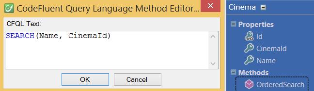
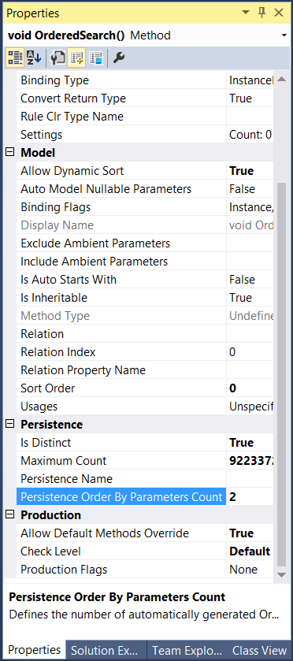

# Sorting

If entity contains sortable properties, those will be taken into account by the search method.

For instance the following declaration:



Will generate:

```sql
CREATE PROCEDURE [dbo].[Cinema_OrderedSearch]
(
 @Name [nvarchar] (256) = NULL,
 @CinemaId [nvarchar] (256) = NULL,
 @_orderBy0 [nvarchar] (64) = NULL,
 @_orderByDirection0 [bit] = 0
)
AS
SET NOCOUNT ON
DECLARE @sql nvarchar(max), @paramlist nvarchar(max)
SELECT @sql=
'SELECT [Cinema].[Cinema_Id], [Cinema].[Cinema_Name], [Cinema].[Cinema_CinemaId] 
    FROM [Cinema]
    WHERE (1 = 1)'
SELECT @paramlist = '@Name nvarchar (256),
    @CinemaId nvarchar (256),
    @_orderBy0 nvarchar (64),
    @_orderByDirection0 bit'
IF @Name IS NOT NULL
    SELECT @sql = @sql + ' AND @Name = [Cinema].[Cinema_Name]'
IF @CinemaId IS NOT NULL
    SELECT @sql = @sql + ' AND @CinemaId = [Cinema].[Cinema_CinemaId]'
DECLARE @orderbyadded int
SELECT @orderbyadded = 0
IF @_orderBy0 = '[Cinema].[CinemaId]'
BEGIN
 IF @orderbyadded = 0
     SELECT @sql = @sql + ' ORDER BY '
 IF @orderbyadded > 0
     SELECT @sql = @sql + ', '
 SELECT @orderbyadded = @orderbyadded + 1
 SELECT @sql = @sql + '[Cinema].[Cinema_CinemaId] '
 IF @_orderByDirection0 = 1
     SELECT @sql = @sql + 'DESC '
 ELSE
     SELECT @sql = @sql + 'ASC '
END
IF @_orderBy0 = '[Cinema].[Name]'
BEGIN
 IF @orderbyadded = 0
     SELECT @sql = @sql + ' ORDER BY '
 IF @orderbyadded > 0
     SELECT @sql = @sql + ', '
 SELECT @orderbyadded = @orderbyadded + 1
 SELECT @sql = @sql + '[Cinema].[Cinema_Name] '
 IF @_orderByDirection0 = 1
     SELECT @sql = @sql + 'DESC '
 ELSE
     SELECT @sql = @sql + 'ASC '
END
IF @_orderBy0 = '[Cinema].[Id]'
BEGIN
 IF @orderbyadded = 0
     SELECT @sql = @sql + ' ORDER BY '
 IF @orderbyadded > 0
     SELECT @sql = @sql + ', '
 SELECT @orderbyadded = @orderbyadded + 1
 SELECT @sql = @sql + '[Cinema].[Cinema_Id] '
 IF @_orderByDirection0 = 1
     SELECT @sql = @sql + 'DESC '
 ELSE
     SELECT @sql = @sql + 'ASC '
END
EXEC sp_executesql @sql, @paramlist,
    @Name,
    @CinemaId,
    @_orderBy0,
    @_orderByDirection0
RETURN
GO
```

If you need to be able to sort by more than one column at a time, you can control the number of 'order by columns' using the **Persistence Order By Parameters Count** property.

