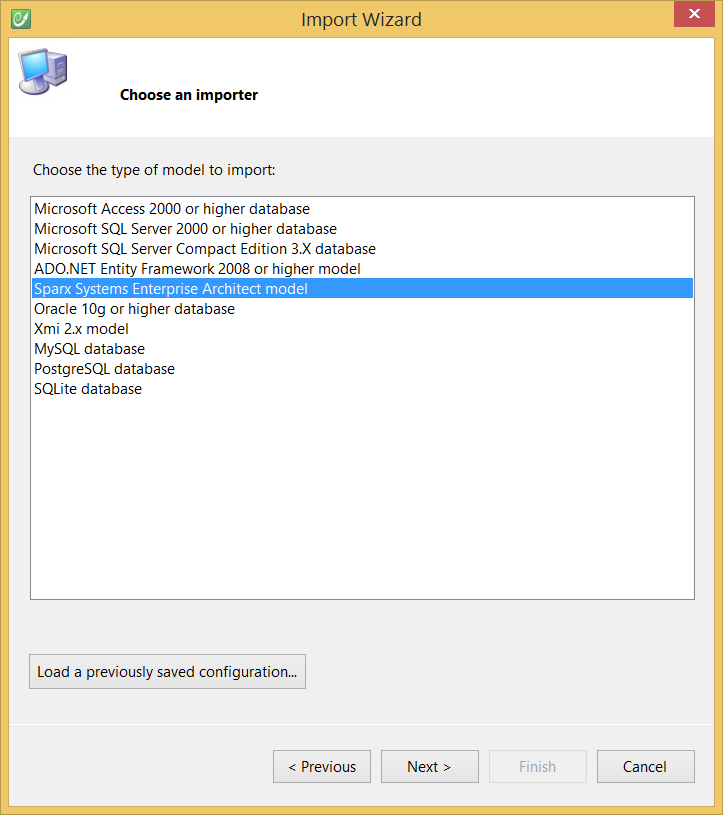

# Enterprise Architect

This topic details how to import an existing Sparx Systems Enterprise Architect model to a CodeFluent Entities model.

## Requirements

* Sparx Systems Enterprise Architect,
* Use the Sparx Systems Enterprise Architect importer.

## Configuration

See the [Modeling - Import](../modeling/import.md) section for more information.