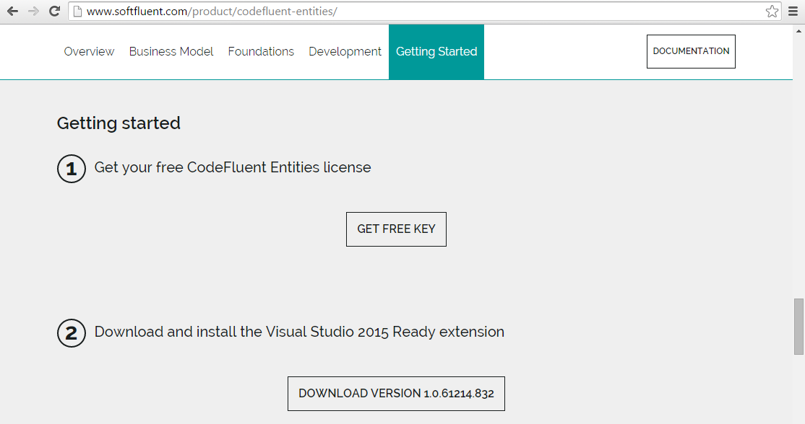
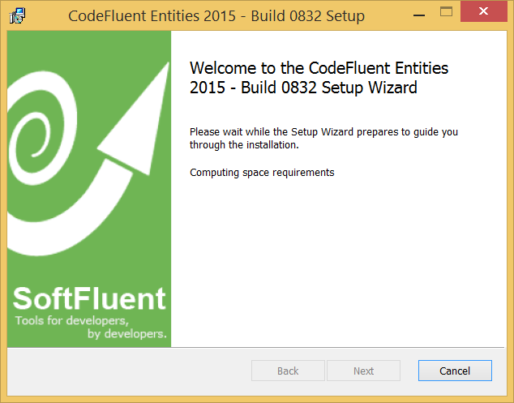
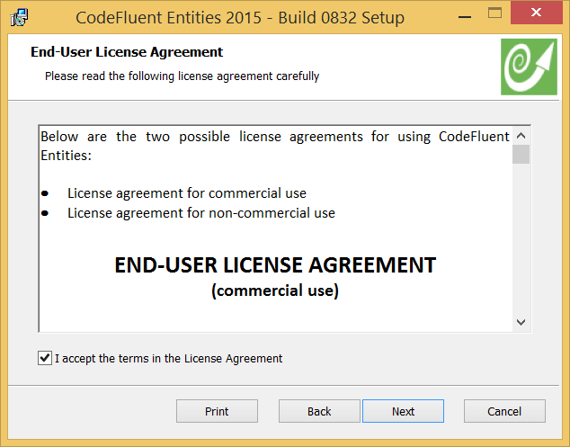
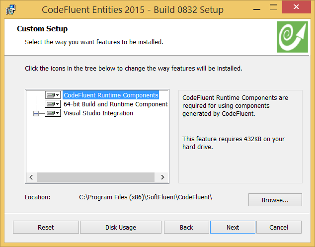
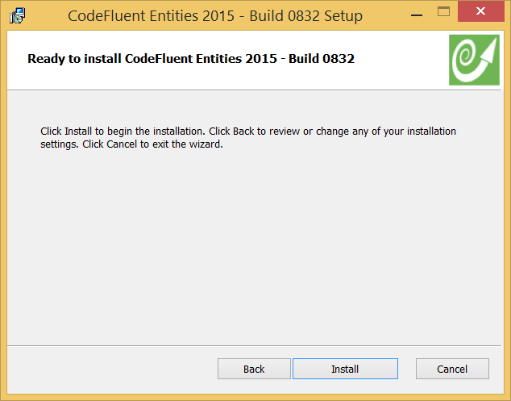
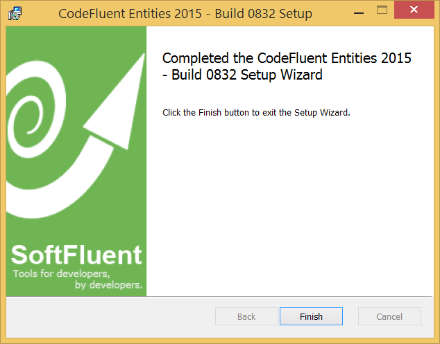
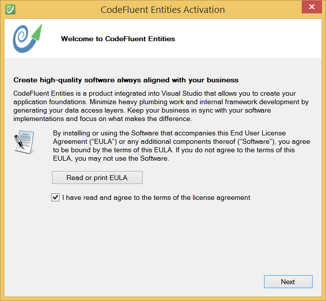

# Setup and installation

## Get your free key

Generate your free key on http://www.softfluent.com/product/codefluent-entities/.

Then download the installer.

## Install

Run the installer and follow the steps.

## Register

On your first use of CodeFluent Entities you will need to register your license. Firstly, accept the End User License Agreement.

Then you just need to register with your SoftFluent.com account.

In case you have any trouble, you can also get your key from your [store account](http://www.softfluent.com/store/products).
