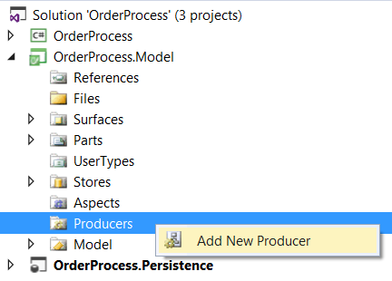
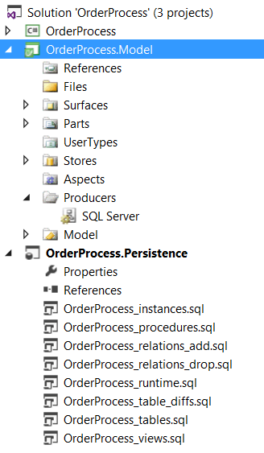

# Generate your data layers

You will need to create Visual Studio projects to host your generated source code:
* C# class library project
* SQL Server database project

## Generate the persistence layer

Then you can add a "Producer" (the term  we use for "code generator") to generate the persistence layer.

Configure the Connection String and target the SQL Server database project.

Build your CodeFluent entities model and see the generated T-SQL scripts.

The most important scripts at this point are:
* **_procedures.sql**: Use it to update the stored procedures
* **_tables.sql**: Use it to create your database schema

See below a *_Save stored procedure creation script:

    CREATE PROCEDURE [dbo].[Customer_Save]
    (
     @Customer_Id [uniqueidentifier],
     @Customer_Name [nvarchar] (256) = NULL,
     @Customer_Email [nvarchar] (256) = NULL,
     @_trackLastWriteUser [nvarchar] (64) = NULL,
     @_rowVersion [rowversion] = NULL
    )
    AS
    SET NOCOUNT ON
    DECLARE @error int, @rowcount int
    DECLARE @tran bit; SELECT @tran = 0
    IF @@TRANCOUNT = 0
    BEGIN
     SELECT @tran = 1
     BEGIN TRANSACTION
    END
    IF(@_trackLastWriteUser IS NULL)
    BEGIN
        SELECT DISTINCT @_trackLastWriteUser = SYSTEM_USER 
    END
    IF(@_rowVersion IS NOT NULL)
    BEGIN
        UPDATE [Customer] SET
         [Customer].[Customer_Name] = @Customer_Name,
         [Customer].[Customer_Email] = @Customer_Email,
         [Customer].[_trackLastWriteUser] = @_trackLastWriteUser,
         [Customer].[_trackLastWriteTime] = GETDATE()
            WHERE (([Customer].[Customer_Id] = @Customer_Id) AND ([Customer].[_rowVersion] = @_rowVersion))
        SELECT @error = @@ERROR, @rowcount = @@ROWCOUNT
        IF(@error != 0)
        BEGIN
            IF @tran = 1 ROLLBACK TRANSACTION
            RETURN
        END
        IF(@rowcount = 0)
        BEGIN
            IF @tran = 1 ROLLBACK TRANSACTION
            RAISERROR (50001, 16, 1, 'Customer_Save')
        RETURN
    END
    SELECT DISTINCT [Customer].[_rowVersion] 
        FROM [Customer]
        WHERE ([Customer].[Customer_Id] = @Customer_Id)
    END
    ELSE
    BEGIN
        INSERT INTO [Customer] (
            [Customer].[Customer_Id],
            [Customer].[Customer_Name],
            [Customer].[Customer_Email],
            [Customer].[_trackCreationUser],
            [Customer].[_trackLastWriteUser])
        VALUES (
            @Customer_Id,
            @Customer_Name,
            @Customer_Email,
            @_trackLastWriteUser,
            @_trackLastWriteUser)
        SELECT @error = @@ERROR, @rowcount = @@ROWCOUNT
        IF(@error != 0)
        BEGIN
            IF @tran = 1 ROLLBACK TRANSACTION
            RETURN
        END
        SELECT DISTINCT [Customer].[_rowVersion] 
            FROM [Customer]
            WHERE ([Customer].[Customer_Id] = @Customer_Id)
    END
    IF @tran = 1 COMMIT TRANSACTION
        
    RETURN
    GO

## Generate the data access layer

Now add the Producer for your C# data access layer and target the C# class library project.

If you build your model, you can have a look at the entity and entity collection classes source code.