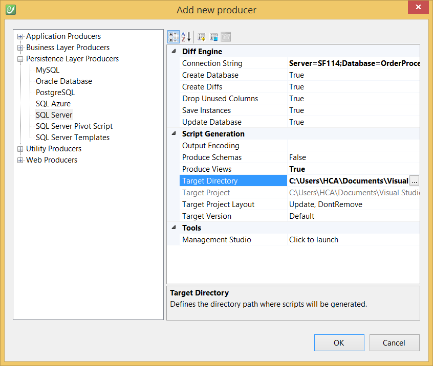
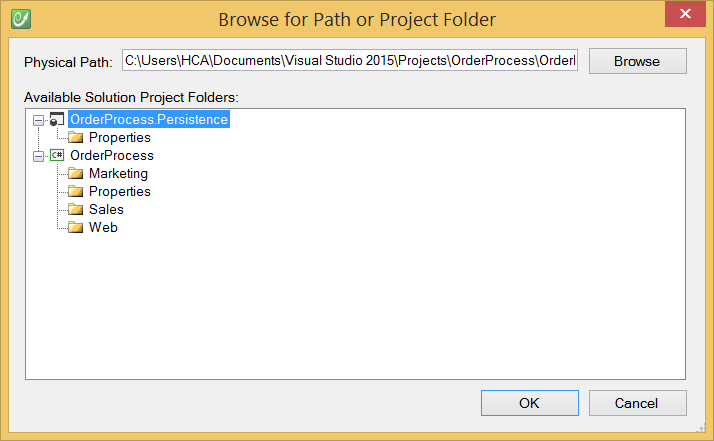
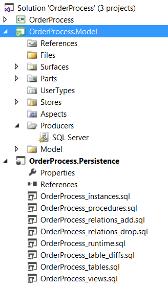
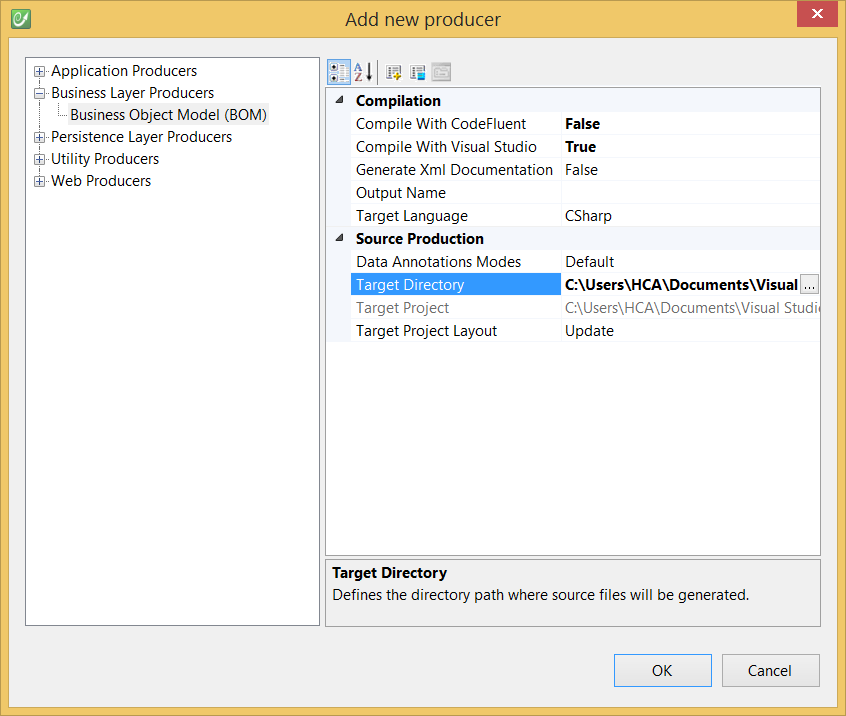
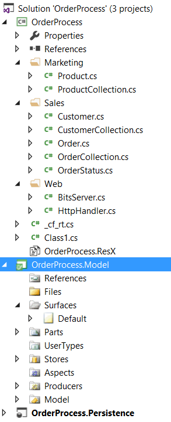

# Generate your data layers

You will need to create Visual Studio projects to host your generated source code:
* C# class library project - **OrderProcess**
* SQL Server database project - **OrderProcess.Persistence**


## Generate the persistence layer

Then you can add a "Producer" (the term  we use for "code generator") to generate the persistence layer.


Configure the Connection String and target the SQL Server database project.





Build your CodeFluent entities model and see the generated T-SQL scripts.



The most important scripts at this point are:
* **_procedures.sql**: Use it to update the stored procedures
* **_tables.sql**: Use it to create your database schema

See below the **Customer_Save** stored procedure creation script:

```sql
CREATE PROCEDURE [dbo].[Customer_Save]
(
 @Customer_Id [uniqueidentifier],
 @Customer_Name [nvarchar] (256) = NULL,
 @Customer_Email [nvarchar] (256) = NULL,
 @_trackLastWriteUser [nvarchar] (64) = NULL,
 @_rowVersion [rowversion] = NULL
)
AS
SET NOCOUNT ON
DECLARE @error int, @rowcount int
DECLARE @tran bit; SELECT @tran = 0
IF @@TRANCOUNT = 0
BEGIN
 SELECT @tran = 1
 BEGIN TRANSACTION
END
IF(@_trackLastWriteUser IS NULL)
BEGIN
    SELECT DISTINCT @_trackLastWriteUser = SYSTEM_USER 
END
IF(@_rowVersion IS NOT NULL)
BEGIN
    UPDATE [Customer] SET
     [Customer].[Customer_Name] = @Customer_Name,
     [Customer].[Customer_Email] = @Customer_Email,
     [Customer].[_trackLastWriteUser] = @_trackLastWriteUser,
     [Customer].[_trackLastWriteTime] = GETDATE()
        WHERE (([Customer].[Customer_Id] = @Customer_Id) AND ([Customer].[_rowVersion] = @_rowVersion))
    SELECT @error = @@ERROR, @rowcount = @@ROWCOUNT
    IF(@error != 0)
    BEGIN
        IF @tran = 1 ROLLBACK TRANSACTION
        RETURN
    END
    IF(@rowcount = 0)
    BEGIN
        IF @tran = 1 ROLLBACK TRANSACTION
        RAISERROR (50001, 16, 1, 'Customer_Save')
    RETURN
END
SELECT DISTINCT [Customer].[_rowVersion] 
    FROM [Customer]
    WHERE ([Customer].[Customer_Id] = @Customer_Id)
END
ELSE
BEGIN
    INSERT INTO [Customer] (
        [Customer].[Customer_Id],
        [Customer].[Customer_Name],
        [Customer].[Customer_Email],
        [Customer].[_trackCreationUser],
        [Customer].[_trackLastWriteUser])
    VALUES (
        @Customer_Id,
        @Customer_Name,
        @Customer_Email,
        @_trackLastWriteUser,
        @_trackLastWriteUser)
    SELECT @error = @@ERROR, @rowcount = @@ROWCOUNT
    IF(@error != 0)
    BEGIN
        IF @tran = 1 ROLLBACK TRANSACTION
        RETURN
    END
    SELECT DISTINCT [Customer].[_rowVersion] 
        FROM [Customer]
        WHERE ([Customer].[Customer_Id] = @Customer_Id)
END
IF @tran = 1 COMMIT TRANSACTION
    
RETURN
GO
```


## Generate the data access layer

Now add the Producer for your C# data access layer and target the C# class library project.



If you build your model, you can have a look at the entity and entity collection classes source code.



You have for entity classes:
* Properties according to your modeled entity
* Save and Delete method
* ...

You have for entity collection classes:
* Load methods (object oriented load "LoadXXX", paginated one "*PageLoadXXX" or using an IDataReader instead of objects "DataLoadXXX" / "PageDataLoadXXX")
* SaveAll method
* ... 

See below the **LoadAll** method for the Product entity collection class:

```csharp
[System.ComponentModel.DataObjectMethodAttribute(System.ComponentModel.DataObjectMethodType.Select, true)]
public static OrderProcess.Marketing.ProductCollection LoadAll()
{
    OrderProcess.Marketing.ProductCollection ret = OrderProcess.Marketing.ProductCollection.PageLoadAll(int.MinValue, int.MaxValue, null);
    return ret;
}
```

See below the **PageLoadAll** method:

```csharp
[System.ComponentModel.DataObjectMethodAttribute(System.ComponentModel.DataObjectMethodType.Select, true)]
public static OrderProcess.Marketing.ProductCollection PageLoadAll(int pageIndex, int pageSize, CodeFluent.Runtime.PageOptions pageOptions)
{
    if ((pageIndex < 0))
    {
        pageIndex = 0;
    }
    if ((pageSize < 0))
    {
        if ((pageOptions != null))
        {
            pageSize = pageOptions.DefaultPageSize;
        }
        else
        {
            pageSize = int.MaxValue;
        }
    }
    OrderProcess.Marketing.ProductCollection ret = new OrderProcess.Marketing.ProductCollection();
    System.Data.IDataReader reader = null;
    try
    {
        reader = OrderProcess.Marketing.ProductCollection.PageDataLoadAll(pageOptions);
        if ((reader == null))
        {
            return ret;
        }
        ret.LoadAll(pageIndex, pageSize, pageOptions, reader);
    }
    finally
    {
        if ((reader != null))
        {
            reader.Dispose();
        }
        CodeFluent.Runtime.CodeFluentPersistence.CompleteCommand(OrderProcess.Constants.OrderProcessStoreName);
    }
    return ret;
}
```

See below the **PageDataLoadAll** method:

```csharp
public static System.Data.IDataReader PageDataLoadAll(CodeFluent.Runtime.PageOptions pageOptions)
{
    CodeFluent.Runtime.CodeFluentPersistence persistence = CodeFluentContext.Get(OrderProcess.Constants.OrderProcessStoreName).Persistence;
    persistence.CreateStoredProcedureCommand(null, "Product", "LoadAll");
    if ((pageOptions != null))
    {
        System.Collections.IEnumerator enumerator = pageOptions.OrderByArguments.GetEnumerator();
        bool b;
        int index = 0;
        for (b = enumerator.MoveNext(); b; b = enumerator.MoveNext())
        {
            CodeFluent.Runtime.OrderByArgument argument = ((CodeFluent.Runtime.OrderByArgument)(enumerator.Current));
            persistence.AddParameter(string.Format("@_orderBy{0}", index), argument.Name);
            persistence.AddParameter(string.Format("@_orderByDirection{0}", index), ((int)(argument.Direction)));
            index = (index + 1);
        }
    }
    System.Data.IDataReader reader = CodeFluentContext.Get(OrderProcess.Constants.OrderProcessStoreName).Persistence.ExecuteReader();
    return reader;
}
```

See below the **Save** method:

```csharp
public virtual bool Save()
{
    bool localSave = this.BaseSave(false);
    return localSave;
}

protected virtual bool BaseSave(bool force)
{
    if ((this.EntityState == CodeFluent.Runtime.CodeFluentEntityState.ToBeDeleted))
    {
        this.Delete();
        return false;
    }
    CodeFluent.Runtime.CodeFluentEntityActionEventArgs evt = new CodeFluent.Runtime.CodeFluentEntityActionEventArgs(this, CodeFluent.Runtime.CodeFluentEntityAction.Saving, true);
    this.OnEntityAction(evt);
    if ((evt.Cancel == true))
    {
        return false;
    }
    CodeFluentPersistence.ThrowIfDeleted(this);
    this.Validate();
    if (((force == false) 
                && (this.EntityState == CodeFluent.Runtime.CodeFluentEntityState.Unchanged)))
    {
        return false;
    }
    CodeFluent.Runtime.CodeFluentPersistence persistence = CodeFluentContext.Get(OrderProcess.Constants.OrderProcessStoreName).Persistence;
    persistence.CreateStoredProcedureCommand(null, "Product", "Save");
    persistence.AddParameter("@Product_Reference", this.Reference, CodeFluentPersistence.DefaultGuidValue);
    persistence.AddParameter("@Product_Name", this.Name, default(string));
    persistence.AddParameter("@Product_Price", this.Price, CodeFluentPersistence.DefaultDecimalValue);
    persistence.AddRawParameter("@Product_IsAvailable", this.IsAvailable);
    persistence.AddParameter("@_trackLastWriteUser", persistence.Context.User.Name);
    persistence.AddParameter("@_rowVersion", this.RowVersion);
    System.Data.IDataReader reader = null;
    try
    {
        reader = persistence.ExecuteReader();
        if ((reader.Read() == true))
        {
            this.ReadRecordOnSave(reader);
        }
        CodeFluentPersistence.NextResults(reader);
    }
    finally
    {
        if ((reader != null))
        {
            reader.Dispose();
        }
        persistence.CompleteCommand();
    }
    this.OnEntityAction(new CodeFluent.Runtime.CodeFluentEntityActionEventArgs(this, CodeFluent.Runtime.CodeFluentEntityAction.Saved, false, false));
    this.EntityState = CodeFluent.Runtime.CodeFluentEntityState.Unchanged;
    return true;
}
```
