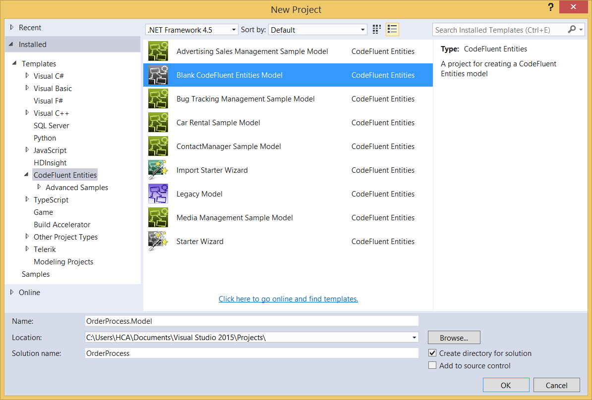
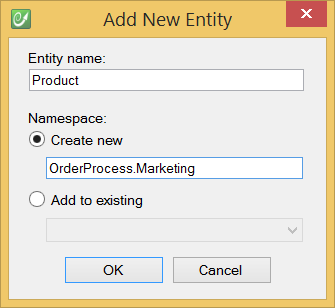

# Model your business

## Create your first project

Create a project from the Visual Studio templates in the CodeFluent Entities category.

Select the "Blank CodeFluent Entities" Model template, and name it **OrderProcess.Model**, we will use the proposed "OrderProcess" namespace.

## Create an entity

CodeFluent Entities allows you to define entities and enumerations. You can use the ribbon of top of the graphical modeler surface integrated into the Visual Studio.

When you create an entity, you also need to choose a namespace (which will ultimately correspond to a .NET namespace).

When you add a property to an entity, you also need to specify its type, which can be simple (integer, string, currency, date, time, etc.), advanced (images, files, etc.) or of a type defined in the model (entity, entity collection, enumeration).

## Create an enumeration

You may also need an enumeration to define a list of possible values of a property, for example the status of an order.

And configure the possible values.

Then edit the data type of the "Status" property from the "Type Name" property grid value.

## Add relationships

You can also add properties with entity or entity collection type. This will create a relation (as in "relational database") or relationship between the two entities (the one that defines the property and the one that defines the property type).

The modeler will ask you to define the characteristics of the relationship you're going to create. Here we need to create a Customer property on the Order entity and assume that one Customer can have many Orders. Note you should always choose the phrase that obviously matches the names of the properties. If the phrase doesn't correspond to what you want to model, then the names of the properties may be wrong with regard to it.

You can also use a Entity Collection type.

Note you can also define a relation between two entities by holding SHIFT+click from property to property or entity to property:

