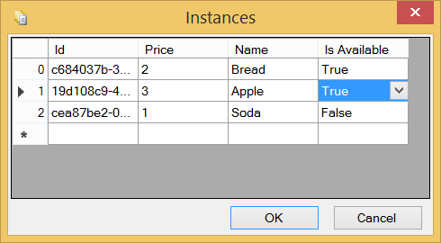
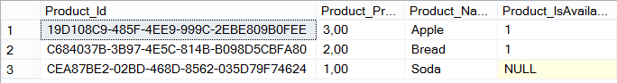
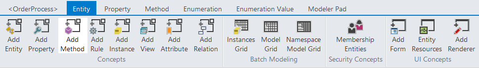
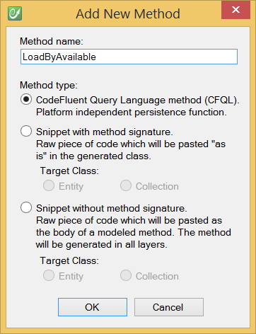
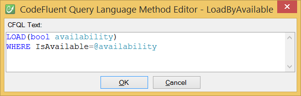
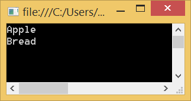

# Update your model

## Add a property

First, add a new "IsAvailable" boolean property on the Product entity. Then, open the Instances Grid from the ribbon to define what would be the initial list of available products. You can use the newly created property without having generated anything since you added that new property.




Now, after having generated the result, you can check inside the **tables_diffs.sql** script in the SQL Server database project. You should see something similar to this:

```sql
/* column 'Product_IsAvailable' was not found in table 'Product'. */
ALTER TABLE [dbo].[Product] ADD [Product_IsAvailable] [bit] NULL
```

And your instances are also up-to-date (Note the NULL correspond to the False value, this is by design):




## Add a method

Let's add a new Load method to our Product entity, and make sure that method uses this new property we've just created.





We write this method using CFQL (CodeFluent Query Language) which is a super simple yet powerful integrated language. Ultimately, this method will be generated as a stored procedure, but at this modeling level, it's very easy to code and read:



Now, if you build your model again, you can see this stored procedure generated and deployed to your development server:

```sql
CREATE PROCEDURE [dbo].[Product_LoadByAvailable]
(
 @availability [bit],
 @_orderBy0 [nvarchar] (64) = NULL,
 @_orderByDirection0 [bit] = 0
)
AS
SET NOCOUNT ON
SELECT DISTINCT [Product].[Product_Id], [Product].[Product_Price], [Product].[Product_Name], [Product].[Product_IsAvailable], [Product].[_trackLastWriteTime], [Product].[_trackCreationTime], [Product].[_trackLastWriteUser], [Product].[_trackCreationUser], [Product].[_rowVersion] 
    FROM [Product]
    WHERE ([Product].[Product_IsAvailable] = @availability)

RETURN
GO
```

## Update your application

Now if we replace in the console application these instructions:

```csharp
using System;
using OrderProcess.Marketing;

namespace OrderProcess.Application
{
    class Program
    {
        static void Main(string[] args)
        {
            foreach (Product product in ProductCollection.LoadAll())
            {
                Console.WriteLine(product.Name);
            }
            Console.ReadKey();
        }
    }
}
```

By these ones:

```csharp
using System;
using OrderProcess.Marketing;

namespace OrderProcess.Application
{
    class Program
    {
        static void Main(string[] args)
        {
            foreach (Product product in ProductCollection.LoadByAvailable(true))
            {
                Console.WriteLine(product.Name);
            }
            Console.ReadKey();
        }
    }
}
```

The application will now display only the available products.

