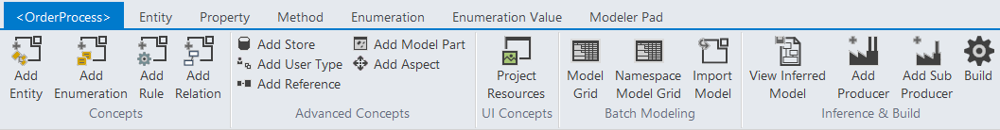
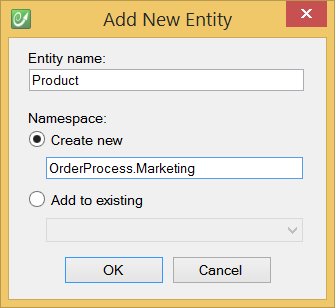
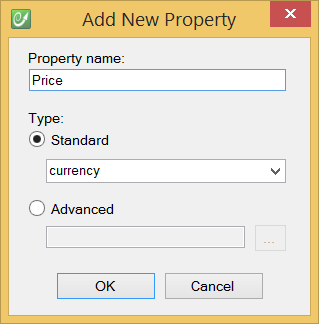
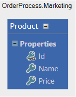
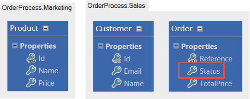
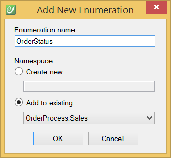
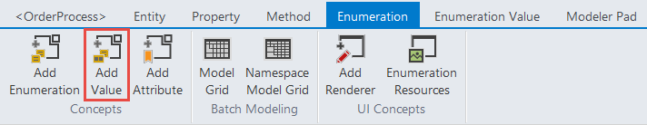
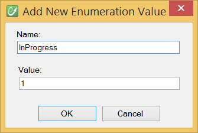
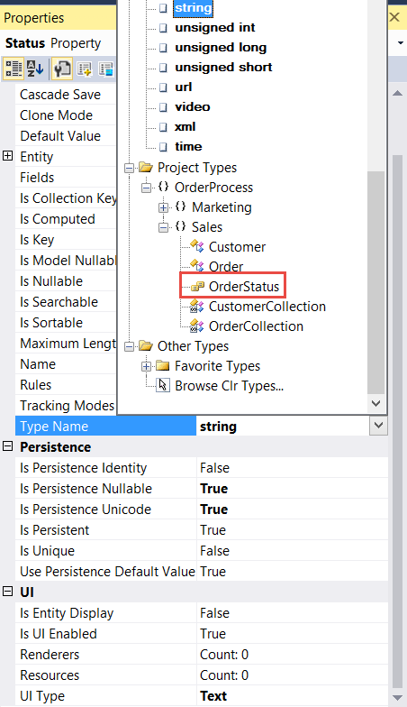
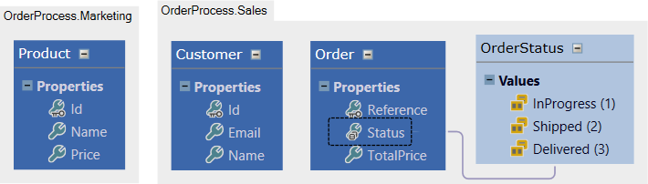

# Model your business

Create the project from the Visual Studio templates in the CodeFluent Entities category.

CodeFluent Entities allows you to define entities and enumerations. You can use the ribbon of the graphical modeler, directly integrated into the Visual Studio.

When you create an entity, you need to choose the namespace location.

When you add a property to an entity, you need to specify the data type.

You may also need an enumeration to constraint possible values of a property, for example a status.

And configure the possible values.

Then edit the datatype of the "Status" property from the "Type Name" property grid value.

