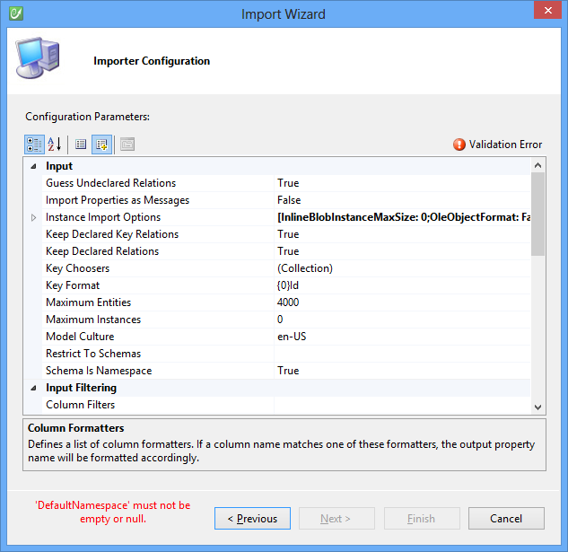
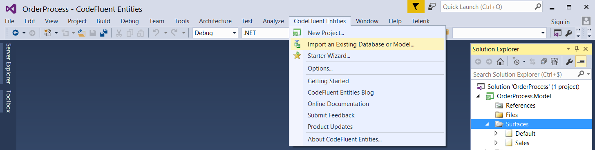
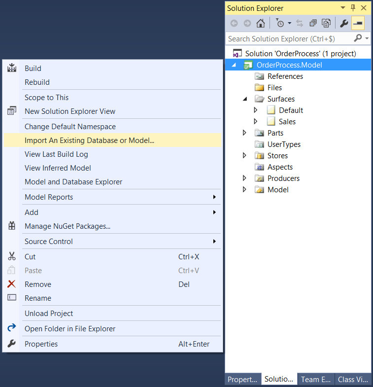
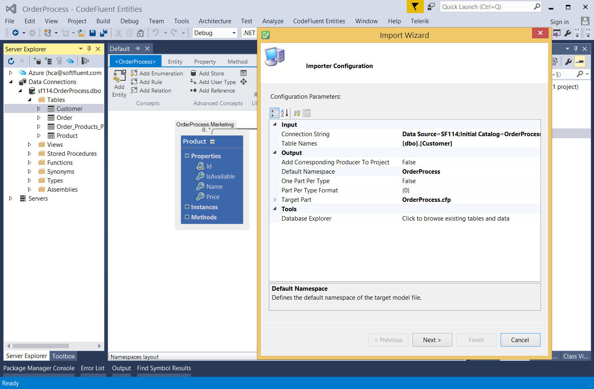

# Import

The importer tool creates an in-memory representation of the source which will then be translated into a CodeFluent Entities model.

The creation of this in-memory representation is a two-step process where:

* An importer connects and iterates through database objects to provide a database independent representation of those concepts (Tables, Columns, Keys, etc),
* Those persistence concepts are then translated into a corresponding CodeFluent Entities model (Entities, Properties, Relations, etc).
 
Therefore each persistence system requires its own importer to translate its platform dependent concepts into those common concepts. Once this is done, the same import engine is shared by all importers and consequently they share a same set of features which is detailed in this topic. Those configuration parameters can be defined through the Importer Configuration page of the wizard:

The modeler provides a wizard to import your existing database or schema:

* Microsoft SQL Server
* Microsoft SQL Server CE
* Entity Framework

### Parsing the input

A set of parameters indicating the engine how and what to import.

| **Properties** | **Description** |
| -- | -- |
| Import Properties as Messages | Determines if the importer must use extended properties and import them as messages. Default is false. |
| Keep Declared Relations | Determines if declared relations are used. Default is true. |
| Key Choosers | Determines if declared relations on keys are used. Default is true. |
| Maximum Entities | Defines the maximum number of entities to import. Default is 4000. |
| Maximum Instances | Defines the maximum number of instances to import per entity. 0 means no instances will be imported. Importing a lot of instances can have a serious impact on model loading and processing performance. Default is 0. |
| Model Culture | Defines the culture used to define the model. This is mostly used for plural determination. Default is "en-US". |
| Guess Undeclared Relation | Determines if the importer must guess undeclared relations (relations between tables without explicit foreign keys). Default is true. |
| Schema is Namespace | Determines if the table schema (or 'owner' depending on database vendor terminology) will become the entity namespace. Default is true. |
| Key Choosers | Defines a list of key choosers. Each key chooser defines a key property for a given entity. |
| Restrict To Schemas | Defines a comma separated list of schemas names. Only tables in these schemas will be imported. If this value is undefined, all tables will be imported, regardless of their schema. |
| Key Format | Defines the general key format for primary keys. {0} represents the column name. Default is "{0}Id". |
| Table Names | Defines a comma separated list of table names to import. If this value is undefined, all tables will be imported. |

### Filtering the input

| **Properties** | **Description** |
|--|--|
| xxx | xxx |

### Filtering the input

| **Properties** | **Description** |
|--|--|
| xxx | xxx |

### Filtering the input

| **Properties** | **Description** |
|--|--|
| Default Namespace | Defines the default namespace of the target model file. |
| Target Part | Defines the target part for the imported entities. When importing creating a new project, this defines the root model file that will contain the project. |
| Instances Target Part | Defines the target part for the imported instances. |
| One Part Per Type | Determines if one part per type must be created. In this case, the TargetPart will only be used for storing project information. |
| Part Per Type Format | Defines the part-per-type file name format. Used only if One Part Per Type is set to true. Index 0 is the entity full type name, 1 is the entity name, 2 is the entity namespace. Default is "{0}". |
| Instances Free Format | Determines if instances part will have the free format. The free format is recommended if the number of instances is important. Default is true. |
| Project Save Options | Defines options for the target model file. |
| Remove Plural | Determines if plural must be removed. This is related to the culture model. Default is true. |
| Save Parts | Determines if modified parts must be saved or not. Default is false. |
| Camelize Names | Determines if names must be camelized. Default is true. |
| Create Instances Target Part | Determines if a separate part must be created for instances. Default is false. |
| Create Related Properties | Determines if the importer must create both ways entity relations. Default is true. |
| Generated Key Format | Defines the generated key format. {0} represents the column name. Default is "{0}Id". |
| Create Primary Key Column | Determines if the importer must create keys for entities corresponding to tables without primary key. Default is true. |
| Enable Primary Key Promotion | Determines if the importer will automatically promote a property as primary key, if node is defined and a suitable one is found. Default is true. |

### Formatting the output

 A set of parameters so the generated output looks as good as possible.
 
| **Properties** | **Description** |
|--|--|
| Table Formatters | Defines a list of table formatters. If a table name matches one of these formatters, the output entity name will be formatted accordingly. |
| Column Formatters | Defines a list of column formatters. If a column name matches one of these formatters, the output property name will be formatted accordingly. |
| Common Formatters | Defines a list of common name formatters. If a name matches one of these formatters, the output will be formatted accordingly. |

This wizard can be accessed from several ways depending your usage.

## Toolbar menu

This action will create and configure a brand new solution to import from an existing database or model.

## Context menu

This action will import a database or model to the current CodeFluent Entities project.

## Drag and drop

You can drag and drop tables from the SQL Server Object Explorer onto a CodeFluent Entities Surface. This will automatically trigger the wizard, configured for the tables you dragged and dropped.

