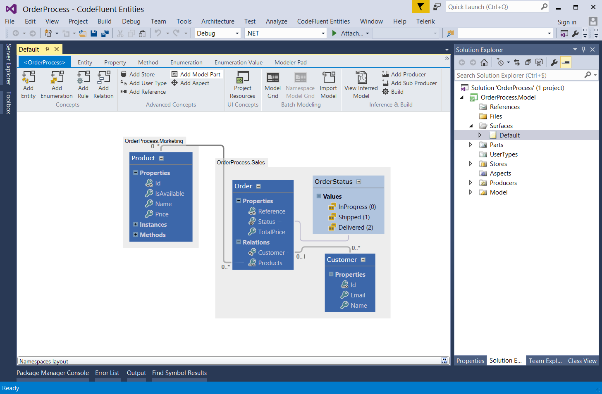
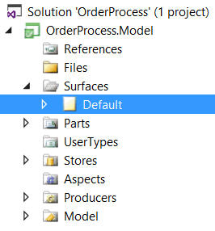

# Overview

## The modeler

The modeler is a design tool integrated to Visual Studio that allow you to modelize your business.

Physically, a CodeFluent Entities project is a package composed of files which are called parts. Parts can be of several types:

* **Surface model parts**: one of several XML or CFP files displayed under the **Surfaces** folder. They are canvases on which you will design your application.
* **Model parts**: one or several XML or CFP files displayed under the **Parts** folder. They are storage units in which concepts drawn on Surfaces are actually stored.
* **Resource parts**: any other files referenced by the project and which will appear under the **Files** folder. 

As we said, the Surfaces folder is where our business model will be designed.

## The surfaces

All existing surfaces are listed in the folder **Surfaces** of the CodeFluent Entities Project:

## The ribbon

## Glossary