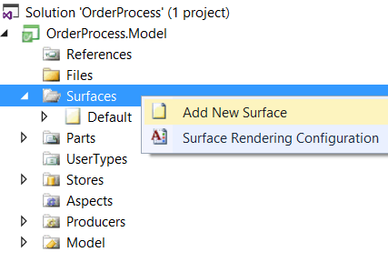
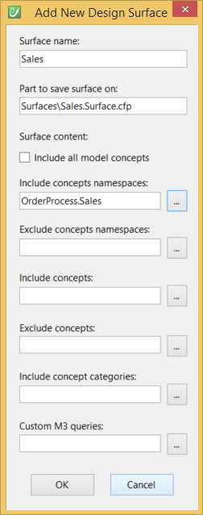
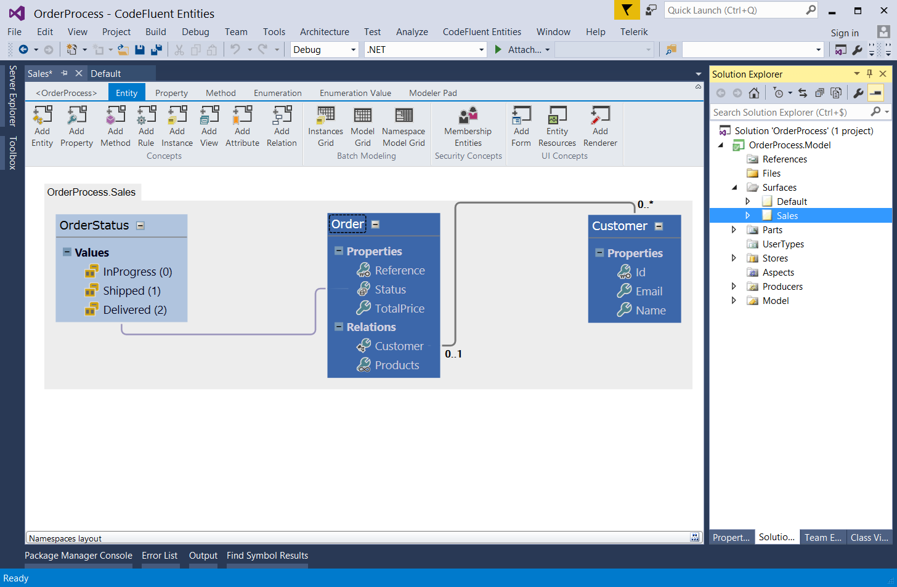
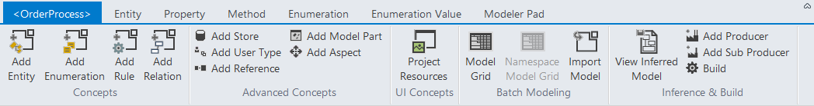
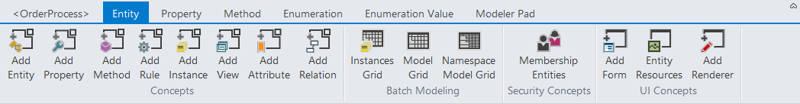
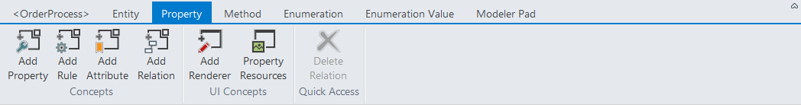
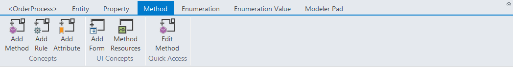
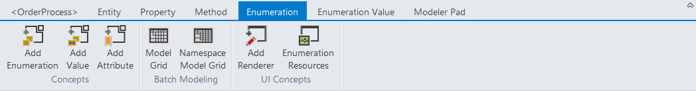
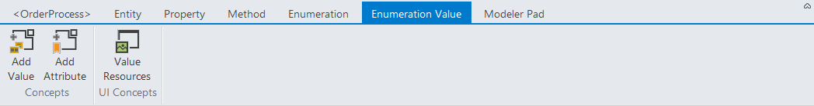
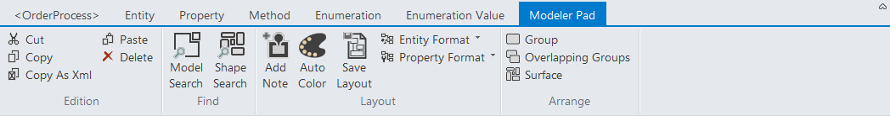

# Overview

## The modeler

The modeler is a design tool integrated to Visual Studio that allow you to modelize your business.

Physically, a CodeFluent Entities project is a package composed of files which are called parts. Parts can be of several types:

* **Surface model parts**: one of several XML or CFP files displayed under the **Surfaces** folder. They are canvases on which you will design your application.
* **Model parts**: one or several XML or CFP files displayed under the **Parts** folder. They are storage units in which concepts drawn on Surfaces are actually stored.
* **Resource parts**: any other files referenced by the project and which will appear under the **Files** folder. 

## The surfaces

As we said, the Surfaces folder is where our business model will be designed. All existing surfaces are listed in the folder **Surfaces** of the CodeFluent Entities Project:

You can create surfaces to render and manage a part of your model.

You can include or exlude namespaces, entities and enumerations.

And display the part of your model you need.

This is very useful for large business models.

## The ribbon

The top ribbon allow you to add concepts to your model.

On an entities, properties, methods and enumerations you can use it to add or edit specific concepts.

The Modeler Pad section allow you to customize you model view.

## Glossary

| Entity | a business entity like 'Customer', 'Order', 'Cat', 'Dog', ... |
| -- | -- |
| 0:2 | 1:2 |

****: 

**Lightweight Entity**: an entity representing a light object such as non persistent objects, structures, etc. It can also be mapped to standard .NET types such as the Point structure or views.

**Relation**: describes the type of relation and cardinality between two entities. The relation can be 1:1, 1:M, M:1 or M:M.

**Inheritance**: an inheritance relationship describes the relationship between a super-type entity and its sub-type entities. An entity can have any number of ascendant or descendant entities.

**Method**: CodeFluent allows the definition of any method (standard C.R.U.D., custom load methods, snippet methods, external business rules, ...) associated with a given entity. Depending on configured producers, these methods may (or may not) be exposed as Services. For example, the Web Service producer creates by default a SOAP operation for every method in the model.

**Property**: an entity has a defined set of properties. Some properties are inherited from ascendant entities. Properties are also used as 'connectors' for relations between entities: if the property's type is an entity or the collection of an entity defined in the CodeFluent model, the property also defines a relation. The cardinality on this side of the relation is M (Many) if the property's type is a collection, 1 (One) if the property's type is an entity.

**Parameter**: every method can have zero to any number of parameters.

**View**: a view is a read only virtual or logical entity associated with a model entity, composed of view properties. Each view property is defined by an expression computed on the associated entity. Changing the data in an entity alters the data shown in the view. Every entity has at least one view, automatically created by CodeFluent, the Default view. This view's properties matches the entity's properties.  At the persistence level, a view can be generated as a real SQL view.

**View Property**: a view has a defined set of view properties, just like an entity has a defined set of properties. View properties have almost the same characteristics as entities properties.