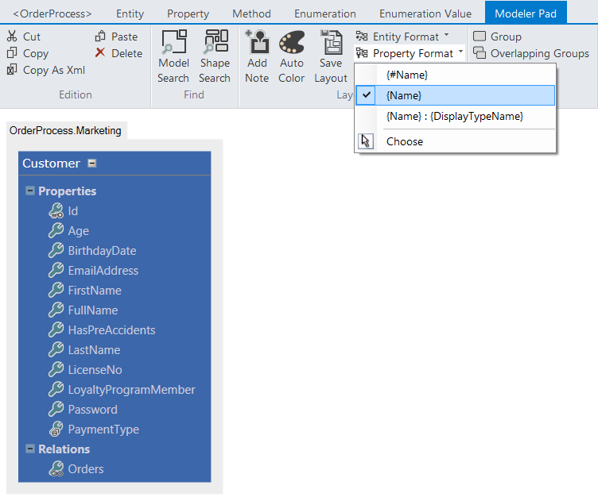
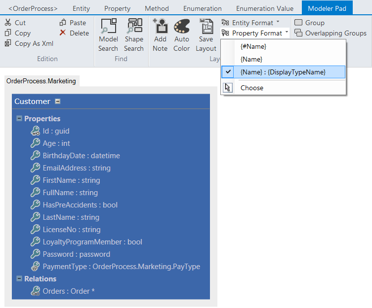

# Tips

## Member Format Expressions

Using CodeFluent Entities, you can use “Member Format Expressions” to customize the way names of entities and properties are formatted.

For more informations, see [this blog article](http://blog.codefluententities.com/2014/09/29/member-format-expression/).