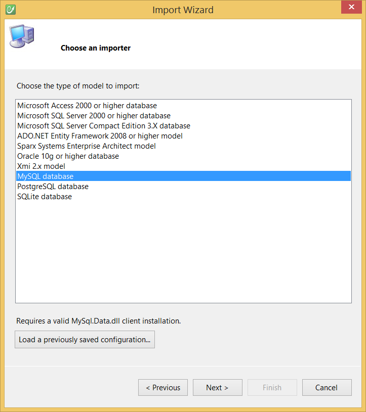

# MySQL

## Requirements

* MySQL 5.1 or upper,
* The [MySQL Connector for .NET](http://www.mysql.com/downloads/connector/net/), version **6.5.4.0**, requires the **MySql.Data** assembly,
* Use the MySQL importer.

## Configuration

See the [Modeling - Import](../modeling/import.md) section for more information.