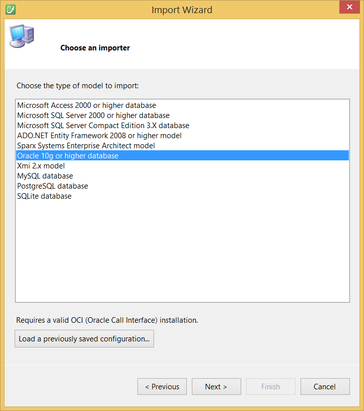

# Oracle Database

This topic details how to import an existing Oracle Database to a CodeFluent Entities model.

## Requirements

* Oracle Database 10g or upper,
* ODP.NET (Oracle.DataAccess.dll),
* Use the Oracle Database importer.

## Configuration

See the [Modeling - Import](../modeling/import.md) section for more information.