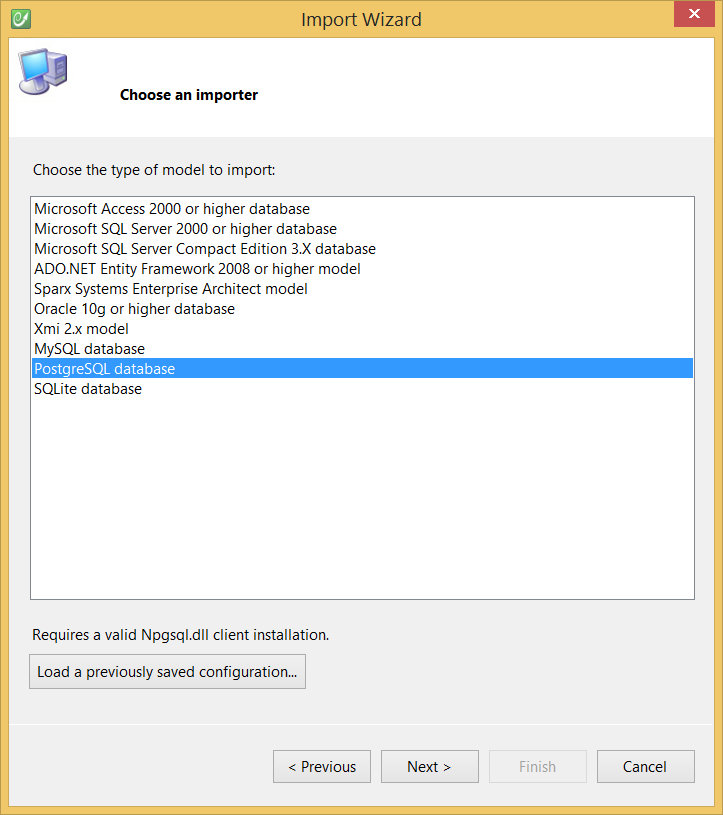

# PostgreSQL

This topic details how to import an existing PostgreSQL database to a CodeFluent Entities model.

## Requirements

* PostgreSQL Server 8.4 or upper,
* The importer relies on the [Npgsql2](http://npgsql.projects.postgresql.org/) library, version **2.0.11**, and requires the Npgsql assembly.
* Use the PostgreSQL importer.

## Configuration

See the [Modeling - Import](../modeling/import.md) section for more information.