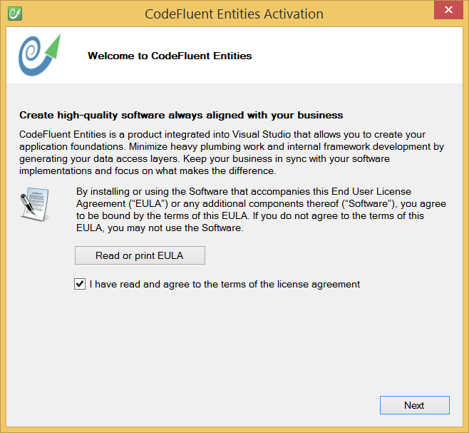
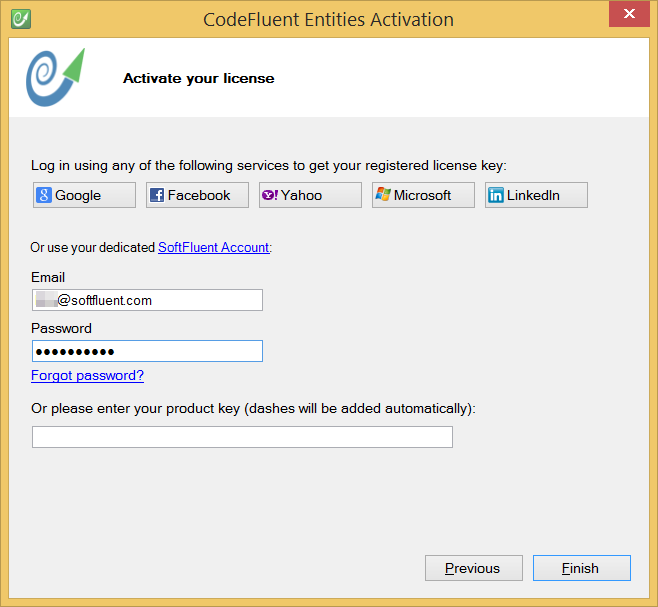

# Registration

## Register

On your first use of CodeFluent Entities you will need to register your license. First, accept the End User License Agreement.

Then activate the licence using with your SoftFluent.com account.

In case of any trouble, you can also get your key from your [store account](http://www.softfluent.com/store/products).

## Troubleshooting Connection Problems

If, for some reason, activation does not work, you can use the **SoftFluent.Licensing.Client.exe** program (available in the installation directory) which provides extra-capabilities.

### Check Connectivity

Using the SoftFluent.Licensing.Client.exe, you can ensure CodeFluent Entities can contact our activation servers. Select Help > Check Connectivity to launch a test. Select **Help > Check Connectivity** to launch a test.

If this test fails, it's probably due to proxy settings or a lack of internet connection.

### Supporting Proxies

By default, the licensing client is configured based on your **Windows Internet Options** (available in the **Control Panel**). Therefore, it should support standard internet options **including proxies**.

However, if ever this does not work automatically, in the **File > Options...** dialog, you can set-up a specific proxy configuration.

## Information collected by the activation process

The following information is collected by the activation process:
* Hardware Id
* Machine Name
* User Name
* OS Version
* CLR Version

As well as the following indicators:
* Interactive Session
* Web Session
* Remote Session
* Virtual Machine

Since the goal of the activation process is to counter piracy, too many activations of the same user key for a too wide range of changes of these parameters may cause a deadlock. For obvious security reasons of our activation process, the rules we apply are not intended to be public (as opposed to collected information that are mentioned above).

Pursuant to the License Agreement, licenses are assigned to physically appointed users, which a standard license use will not result in blocking. If an abnormal blocking should happen, we'll obviously unlock your license.

It is important to note that this process also protects your liability in case of license key theft or illegal use.
If a key is over-used since hacked, we can disable it and assign a new one.