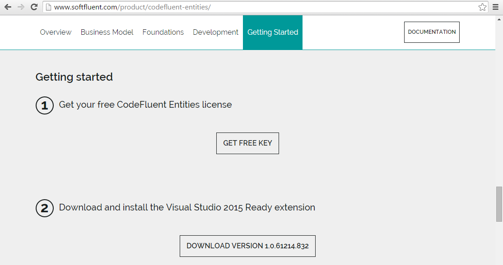
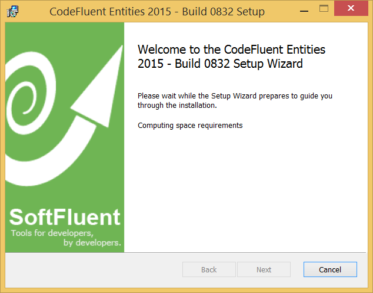
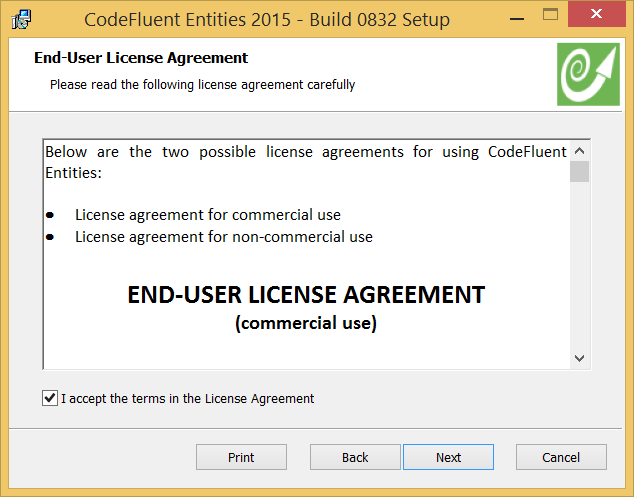
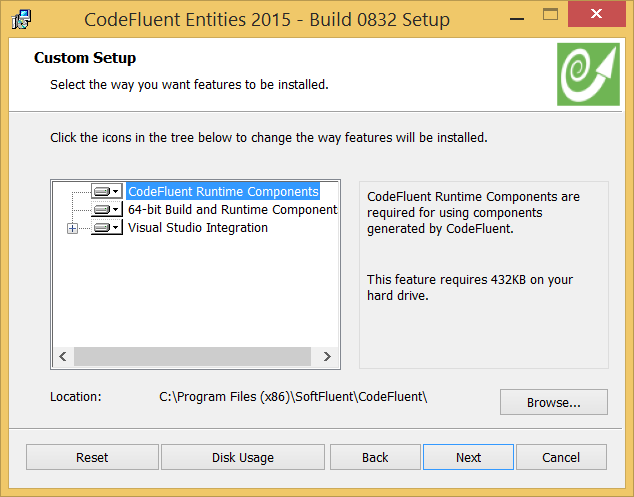
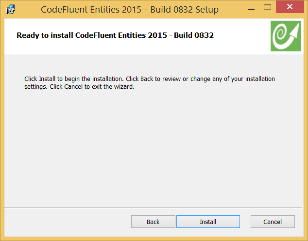
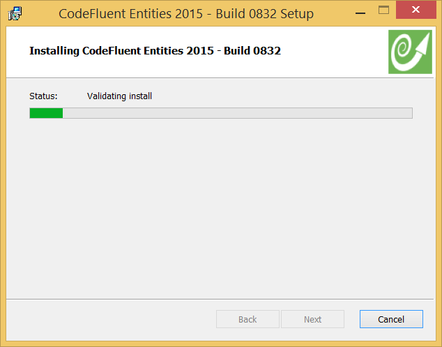
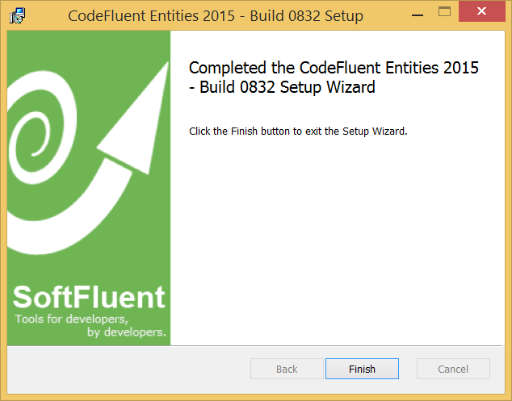
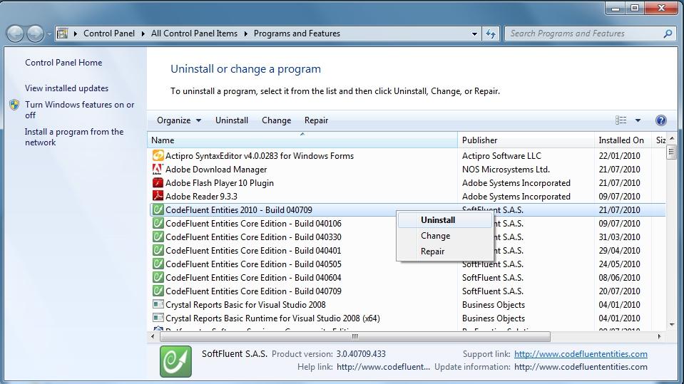

# Setup

## Get your free key

Generate your free key on http://www.softfluent.com/product/codefluent-entities/.

Then download the installer.

## Install

Run the installer and follow the steps.

## Uninstall

Uninstalling the CodeFluent Entities Modeler can be done in the **Control Panel** from the **Add or Remove Programs on XP** or the **Programs and Features panel** on Vista and 7.

