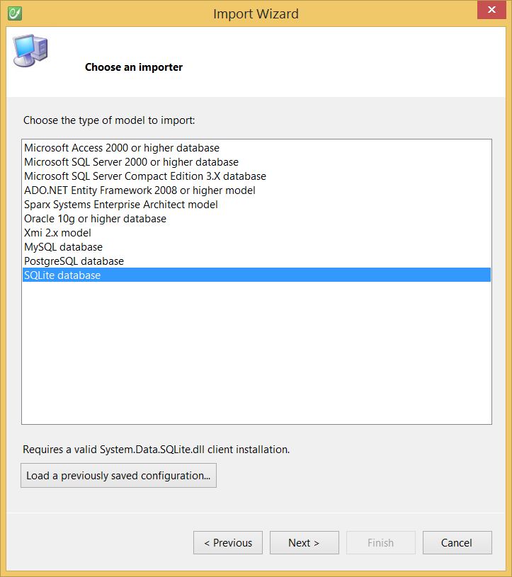

# SQLite

## Requirements

* SQLite,
* Requires a valid **System.Data.SQLite.dll** client installation.
* Use the SQLite importer.

## Configuration

See the [Modeling - Import](../modeling/import.md) section for more information.