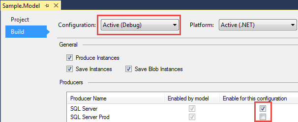
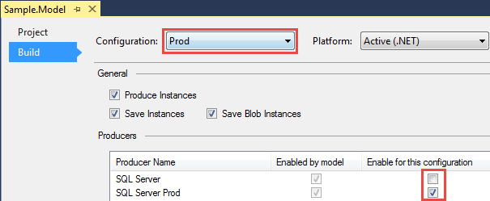

# Build configuration

Sometimes you need to enable or disable producers. For example you want to use one configuration during development, and another for production.

You can define project properties using the standard Visual Studio project configuration editor. To access this screen, select your CodeFluent Entities project in the Solution Explorer and then do a rightclick > Properties (or Alt + Enter).

From this screen, you’ll be able to control Visual Studio project level properties (in the Project tab), as
well as build properties (in the Build tab):

