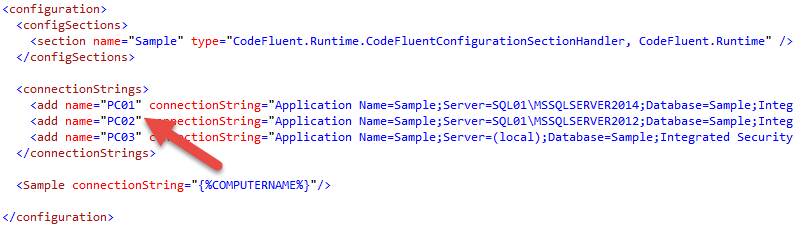

# Connection String

## Default connection string

If no connection string is provided in the configuration file, the default one will be used. Check the database producer section for more details.

## Custom connection string

If you need to specify a connection string in the configuration file, you should use an environment variable such as “COMPUTERNAME”. This way, each developer can set its connection string without affecting other developers, and a unique .config file can be used. When a new developer starts using
the project, he adds a new connection string in the “connectionStrings” tag with the same name as its computer name, like this:



If more than one developer uses the same computer, you can add the username for example:
```{%COMPUTERNAME%_%USERNAME%}```. The connection string name will become ```<machinename>_<user name>```.