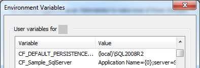

# Database configuration

Database producers may require some level of configuration, for example the connection string.

## Using Default Persistence Server

When you don’t specify a connection string, CodeFluent Entities uses the following connection string:

```
Application Name=[DefaultNamespace];server=[DefaultPersistenceServer];database=[DefaultNamespace];Integrated Security=true
```

Where ```[DefaultNamespace]``` is the default namespace of your CodeFluent Entities project, and
```[DefaultPersistenceServer]``` the default persistence server. By default, the default persistence server is
configured to be **127.0.0.1**.

Of course, you can override the default connection string at the project level thanks to the Default Connection String property (defaultConnectionString attribute in XML) or at the producer level by specifying its connection string explicitly.

However, to keep the model as portable as possible, the best practice is for each developer to set the
default persistence server (independently from all CodeFluent Entities models) to his local “mostly
used server”, the server he’s used to work with most of the time. To set this up, one needs to:
* Run Visual Studio with administrator privileges,
* Get in Tools > Options… > CodeFluent Entities,
* In the advanced tab of the property grid (click the button with the yellow plus sign to access
it), set the Default Persistence Server property to your server.


Doing this ensures the default connection string used by CodeFluent Entities is valid locally. As a
consequence, developers won’t have to override the default connection string in their models
anymore, and this way a model can easily be shared between one another.

*Note: Of course, if the project uses more than one connection string, this will note solve all problems.*

## Using environment variable

If the default connection string does not fit your need, you can set a custom connection string. The
producer accept only one connection string, so the idea is to use an environment variable. For instance:

```
%CF_Sample_SqlServer% = "<connection string>"
```



Then set this environment variable as the producer connection string:


Note: The environment variable will be expanded in the window but in the part (XML file), the
environment variable will be written as expected:

```xml
<cf:producer name="SQL Server" typeName="CodeFluent.Producers.SqlServer.SqlServerProducer, CodeFluent.Producers.SqlServer">
 <cf:configuration connectionString="%CF_Sample_SqlServer%">
</cf:producer>
```