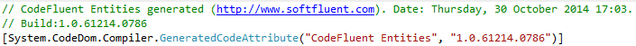
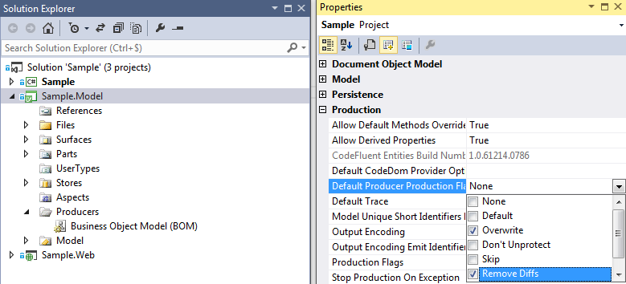
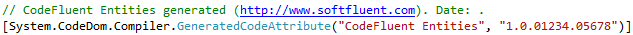

# Merge conflicts

By default, CodeFluent Entities adds generation date and product version in the generated files text.
This means each time you generate files, they are different from the previous version ones, even If you
don’t change the model.



If two or more developers checkin generated files, they may get merge conflict whereas only the
generation date is different. To avoid this issue you can instruct CodeFluent Entities to remove those
information from the generated file. This way, the generated files remain the same if your model does
not change.



The generated file does not contains date and the CodeFluent Entities version number this ```1.0.01234.05678```:



*Note: If you use local workspaces, Visual Studio does not check a file out when the file content does not change. With the remove diffs option, when your model does not change, no file are checked out.*

