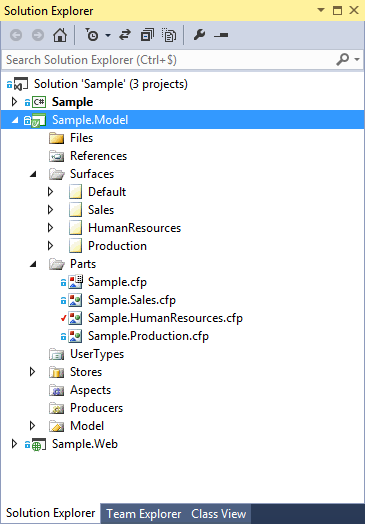
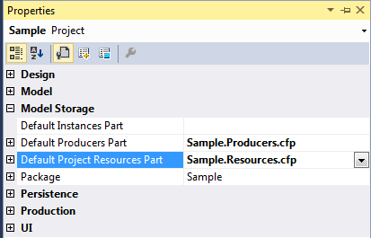
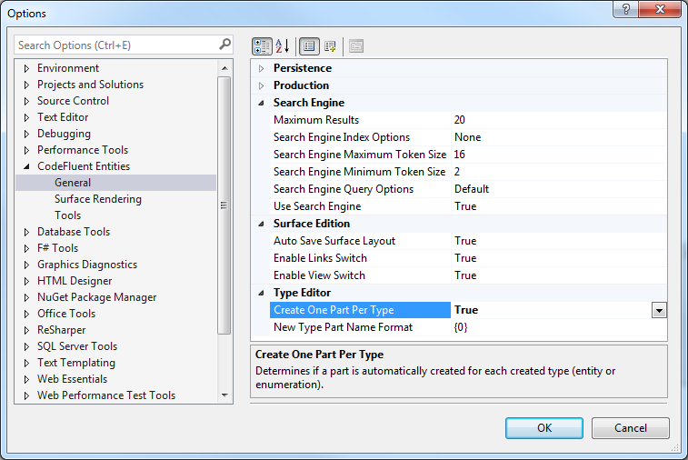
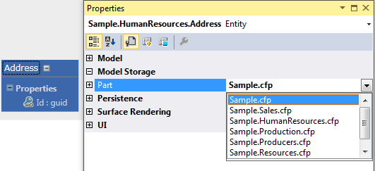
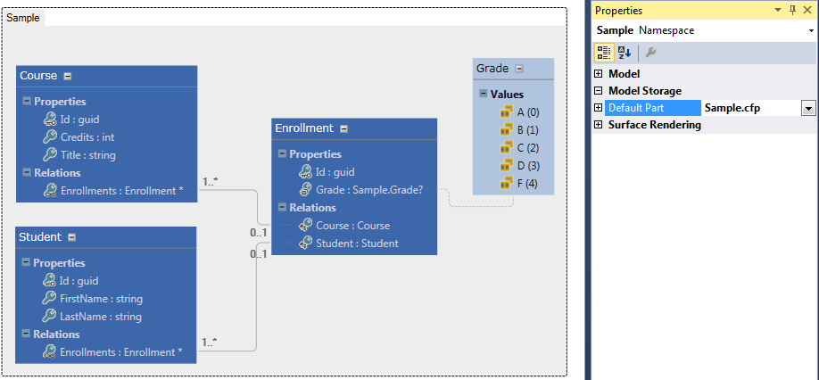

# Project storage

## Splitting your model into parts

CodeFluent Entities allows you to split the model into multiple parts (the storage unit, using an XML
syntax in .XML or .CFP files) and multiple surfaces (used for visualization and editing).

Parts and surfaces are not linked. One surface can contain entities from multiples surfaces or just one
entity from a part and two entities from another part for example.

This allows you to checkout one file at the time, avoiding merging while checking-in, which is very
convenient for teamwork.

By default, everything is located in the main (default) part but we’ll see how to move them in the
“right” part automatically, if desired.

## Concept default part

Many concepts in a CodeFluent Entities model are linked to entities and so, will be stored in the same
part as their related entities. However, you can decide that instances, producers and project resources
concepts will be stored automatically into separate parts:

## Creating one part per type (entity or enumeration)

CodeFluent Entities allows you to automatically create a new part each time you create a new entity
or enumeration. This option is available in the Visual Studio options:

*Note: This setting is not shared nor linked to a specific project, and therefore must be set on each
computer.*

## Moving entities between parts

You can easily move entities between parts using the property grid’s “Part” property:

## Using namespace default part

By default, new entities are added to the main default part whatever surface you are using. You can
however define a default part by type namespace. Select the namespace on the surface and set its
default part in the property grid:

