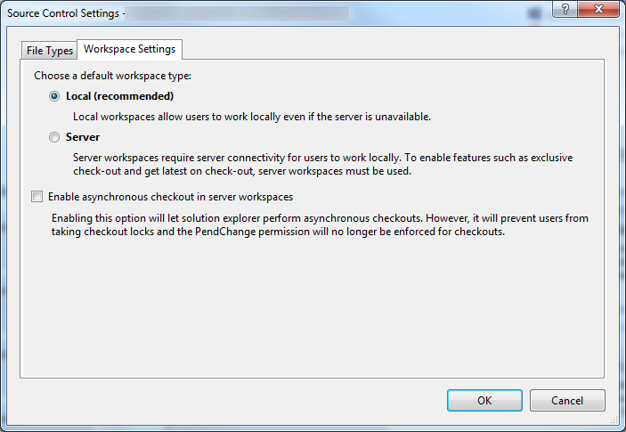
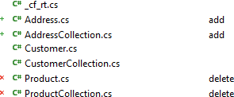

# TFS Workspaces

Both kind of workspaces are supported by CodeFluent Entities. The following post explains the
differences between local workspace and server workspace:

http://blogs.msdn.com/b/phkelley/archive/2013/05/29/server-workspaces-vs-local-workspaces.aspx

Note that Microsoft recommends the use of local workspace:

## Working with server workspace

CodeFluent Entities generates files in a way that’s integrated with Visual Studio (by default), whether
source control is enabled or not. If new files are generated or if files are deleted, it instructs Visual
Studio to add or remove them to the target project, so it will add pending changes in source control, if
source control is enabled.

If a generated file already exists, nothing is changed to the Visual Studio project, so you won’t get any
pending changes (but your files are up to date for compiling). You will then have to manually checkout
and checkin files to the source control. The main reason of this behavior is to allow code generation
when exclusive checkout policy is in place. For example if a developer generates files and checkout
them automatically, no one can generates files until the first developer check them in. If you allow
multiple checkouts, the CodeFluent Entities behavior prevents from unexpected merging conflicts.

*Note: With server workspaces and Visual Studio 2012 or above, when a generated file is removed (for
instance when you remove an entity), the file is removed from the project but still remain on the source
control. You have to manually delete it using the source control explorer. This seems to be a limitation
of the Visual Studio Development Environment, and the underlying target projects systems.*

## Working with local workspace

With local workspace Visual Studio automatically detects file changes on the file system. So each time
you generate files, Visual Studio detects file changes and check the corresponding files out. If files are
identical, Visual Studio does not check files out.

After adding and removing entities you may have the following type of pending changes:

