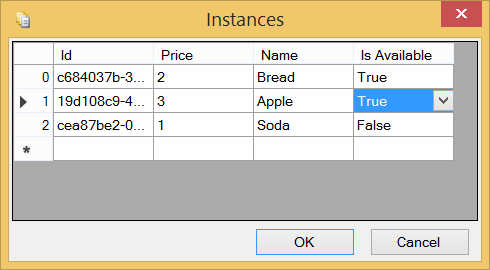
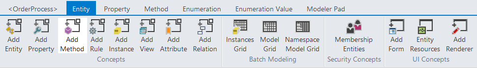
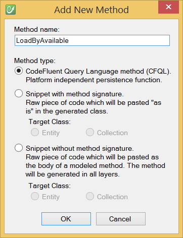
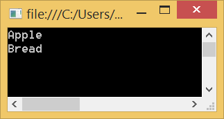

# Update your model

## Add a property

Let's add a new "IsAvailable" boolean property on the Product entity. Then edit the Instances Grid to set the available products.

Have a look at the **tables_diffs.sql** script in the SQL Server database project. You can see this generated instruction:

    /* column 'Product_IsAvailable' was not found in table 'Product'. */
    ALTER TABLE [dbo].[Product] ADD [Product_IsAvailable] [bit] NULL

And your instances are also up to date:

## Add a method

We are going to add a new Load method to our Product entity that use this new property.

We will write this method in CFQL (CodeFluent Query Language) to generate the associated stored procedure.

If you build your model again, you can see this stored procedure generated and deployed:

    CREATE PROCEDURE [dbo].[Product_LoadByAvailable]
    (
     @availability [bit],
     @_orderBy0 [nvarchar] (64) = NULL,
     @_orderByDirection0 [bit] = 0
    )
    AS
    SET NOCOUNT ON
    SELECT DISTINCT [Product].[Product_Id], [Product].[Product_Price], [Product].[Product_Name], [Product].[Product_IsAvailable], [Product].[_trackLastWriteTime], [Product].[_trackCreationTime], [Product].[_trackLastWriteUser], [Product].[_trackCreationUser], [Product].[_rowVersion] 
        FROM [Product]
        WHERE ([Product].[Product_IsAvailable] = @availability)
    
    RETURN
    GO

## Update your application

Now if we replace in the console application this instruction:

    foreach (Product product in ProductCollection.LoadAll())

By this one:

    foreach (Product product in ProductCollection.LoadByAvailable(true))

We will display only the available products in the prompt.

