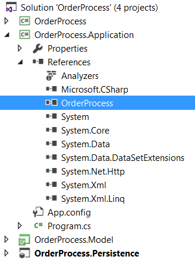
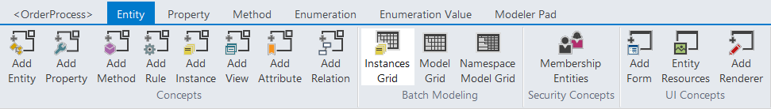
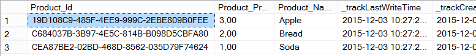

# Use your Data Access Layer

## Create your application

Add a console application project into your solution and add a reference to your generated C# project.

Add a loop to display the list of your products.

    using System;
    using OrderProcess.Marketing;
    
    namespace OrderProcess.Application
    {
        class Program
        {
            static void Main(string[] args)
            {
                foreach (Product product in ProductCollection.LoadByAvailable(true))
                {
                    Console.WriteLine(product.Name);
                }
                Console.ReadKey();
            }
        }
    }

## Add instances

Your application source code should be ready for display, now let's add some data into our model. Select the Product entity and open the Instances Grid windows from the ribbon.

Fill the grid with all the products you need to initialize your database.

Build your model and your database is now up to date.

## Run the application

Now run the application. It should display our three products.
